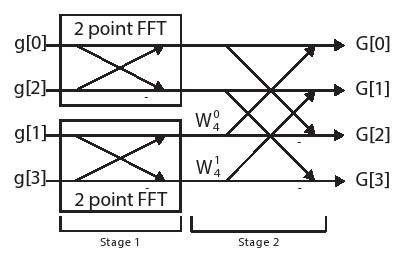
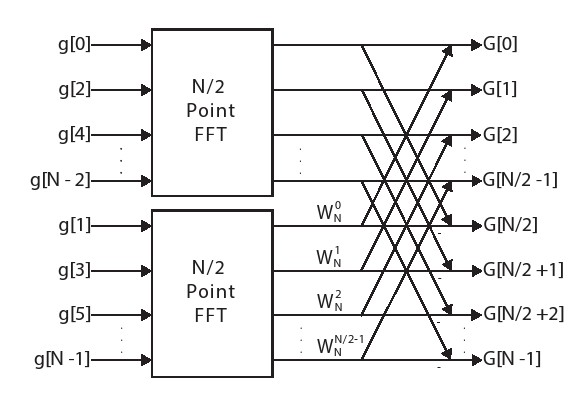
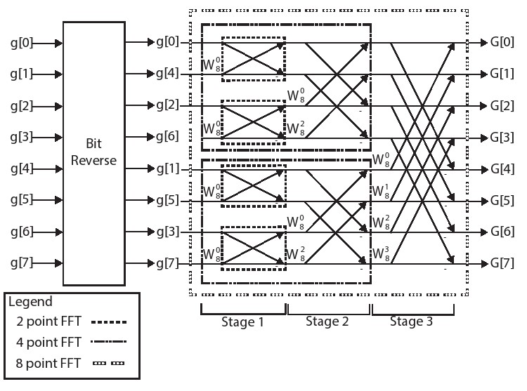
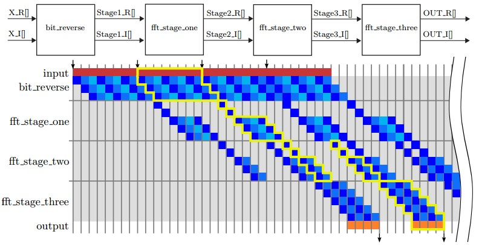

# 第五章 快速傅里叶变换

当取样样本数量为N时，直接使用矩阵向量乘法来执行离散傅里叶变换需要$$\mathcal{O}(n^2)$$次乘法和加法操作。我们可以通过利用矩阵中的常数系数的结构来降低运算的复杂度。在这里S矩阵负责对DFT的系数进行编码码。矩阵的每一行对应于绕复数单位圆周旋转的固定圈数（详情请参阅第4.2章）。这些运算值有大量的冗余，可以利用这些值来降低算法的复杂性。


这里使用的'Big O'符号描述了基于输入数据大小的算法复杂度的一般顺序。有关'Big O'符号及其在分析算法中的使用的完整描述，请参见[17](./BIBLIOGRAPHY.md#45)


快速傅立叶变换（FFT）使用基于S矩阵对称性的分块处理方法。FFT因Cooley-Tukey算法[16]而广为流行，它需要$$\mathcal{O}(n \log n)$$次操作来计算与DFT相同的函数。这可以在大规模信号执行傅立叶变换时提供显着的加速。

计算DFT的分块处理的方法最初由Friedrich Gauss在19世纪初提出。然而，由于高斯的这部分研究并没有在他生前出版，而是出现在他去世后的一些收藏的文献中，所以这件作品一点都不含糊。海德曼等人[32]为FFT的研究史提供了一个很好的背景。

本章的重点是让读者更好地理解FFT算法，因为这是硬件设计优化的重要部分。首先，我们从数学的角度理解一下FFT；其次将讨论的重点放在如何缩小FFT的大小；最后，讨论一些不同的硬件实施方法。

## 5.1 背景

FFT算法利用DFT计算中的对称性来降低算法的复杂度。为了更好地理解这个问题，让我们首先关注一下DFT算法中的研究点，以2点DFT为例。DFT背景介绍执行一个矩阵向量乘法计算$$G[] = S[][] \cdot g[]$$,其中$$g[]$$是输入向量，$$G[]$$是频域的输出数据，$$S[][]$$DFT参数。我们遵循第4.2章中所述相同的系数矩阵记法以及的输入和输出向量。

对于一个两个样本点的DFT，矩阵S的值为：

$$
S =
 \begin{bmatrix}
  W^{0 0}_2 & W^{0 1}_2  \\
  W^{1 0}_2 & W^{1 1}_2
 \end{bmatrix}\quad(5.1)
$$

这里我们使用$$W = e^{-j 2 \pi}$$的概念，其中W的上标表示添加到分子中的值，W的下标表示在复指数的分母值。举个例子，$$W^{2 3}_4 = e^{\frac{-j 2 \pi \cdot 2 \cdot 3}{4}}$$。这和4.2节中讨论的DFT中s的值一样，其中$$s = e^{\frac{-j 2 \pi}{N}}$$,s和W之间的关系为$$s = W_N$$。


 $$e^{-j 2 \pi}$$ 或者 $$W $$经常被称作*旋转因子*，这个术语起源于1966年Gentleman和Sande的论文[27]。


$$
\begin{bmatrix}
G[0] \\
G[1]
\end{bmatrix} =
 \begin{bmatrix}
  W^{0 0}_2 & W^{0 1}_2  \\
  W^{1 0}_2 & W^{1 1}_2
 \end{bmatrix}
 \cdot
  \begin{bmatrix}
  g[0] \\
  g[1]
\end{bmatrix}\quad(5.2)
$$

把这两个等式拓展到2点DFT则有：

$$
\begin{array} {lll}
G[0] & = & g[0] \cdot e^{\frac{-j 2 \pi \cdot 0 \cdot 0}{2}} + g[1] \cdot e^{\frac{-j 2 \pi \cdot 0 \cdot 1}{2}} \\
 & = & g[0] + g[1]
\end{array}\quad(5.3)
$$

由于$$e^{0} = 1$$，所以其中的第二个频率项为:

$$
\begin{array} {lll}
G[1] & = & g[0] \cdot e^{\frac{-j 2 \pi \cdot 1 \cdot 0}{2}} + g[1] \cdot e^{\frac{-j 2 \pi \cdot 1 \cdot 1}{2}} \\
 & = & g[0] - g[1] \\
\end{array}\quad(5.4)
$$

其中$$e^{\frac{-j 2 \pi \cdot 1 \cdot 1}{2}}  = e^{-j \pi } = -1$$。

图5.1为这个计算提供了两种不同的表示方法。a）部分是2点DFT的数据流图。这是我们熟悉的本书的一种习惯的表达方法。b）部分展示了用于相同计算的蝶形结构。这是数字信号处理中使用的典型结构，特别是用于表示FFT中的计算。

蝴蝶结构是一种更紧凑的表示形式，可用于表示大型数据流图。当两条线合在一起时，这表示一个加法操作。箭头线上的任何标签都表示该标签乘以该线上的值。该图中有两个标签:底部水平线上的'-'标志表示该值应该被否定。此后加上由相交的两条线表示的加法与减法相同。第二个标签是 $$W^0_2$$。虽然这是乘法是不必要的（因为 $$W^0_2$$ = 1，这意味着它乘以值'1'），但是把它表示出来是因为它在多样本点的FFT计算中很常见。

现在让我们考虑一个稍微大一点的DFT——4点DFT，有4个输入、4个输出以及一$$4 * 4$$的S矩阵如式5.5所示：

$$
S=
\begin{bmatrix}
 W^{0 0}_4 & W^{0 1}_4 & W^{0 2}_4 & W^{0 3}_4 \\
 W^{1 0}_4 & W^{1 1}_4 & W^{1 2}_4 & W^{1 3}_4 \\
 W^{2 0}_4 & W^{2 1}_4 & W^{2 2}_4 & W^{2 3}_4 \\
 W^{3 0}_4 & W^{3 1}_4 & W^{3 2}_4 & W^{3 3}_4
\end{bmatrix}\quad(5.5)
$$


用于计算频率输出项的DFT方程为：

$$
\begin{bmatrix}
G[0] \\
G[1] \\
G[2] \\
G[3]
\end{bmatrix} =
 \begin{bmatrix}
  W^{0 0}_4 & W^{0 1}_4 & W^{0 2}_4 & W^{0 3}_4 \\
  W^{1 0}_4 & W^{1 1}_4 & W^{1 2}_4 & W^{1 3}_4 \\
  W^{2 0}_4 & W^{2 1}_4 & W^{2 2}_4 & W^{2 3}_4 \\
  W^{3 0}_4 & W^{3 1}_4 & W^{3 2}_4 & W^{3 3}_4
 \end{bmatrix}
 \cdot
  \begin{bmatrix}
  g[0] \\
  g[1]\\
  g[2]\\
  g[3]
\end{bmatrix}\quad(5.6)
$$

现在我们逐个写出G[]中每个频域值的方程。G[0]的方程为:

$$
\begin{array} {lll}
G[0] & = & g[0] \cdot e^{\frac{-j 2 \pi \cdot 0 \cdot 0}{4}} + g[1] \cdot e^{\frac{-j 2 \pi \cdot 0 \cdot 1}{4}} + g[2] \cdot e^{\frac{-j 2 \pi \cdot 0 \cdot 2}{4}} + g[3] \cdot e^{\frac{-j 2 \pi \cdot 0 \cdot 3}{4}}\\
 & = & g[0] + g[1] + g[2] + g[3] \\
\end{array}\quad(5.7)
$$

G[1]的方程为:

$$
\begin{array} {lll}
G[1] & = & g[0] \cdot e^{\frac{-j 2 \pi \cdot 1 \cdot 0}{4}} + g[1] \cdot e^{\frac{-j 2 \pi \cdot 1 \cdot 1}{4}} + g[2] \cdot e^{\frac{-j 2 \pi \cdot 1 \cdot 2}{4}} + g[3] \cdot e^{\frac{-j 2 \pi \cdot 1 \cdot 3}{4}}\\
 & = & g[0] + g[1] \cdot e^{\frac{-j 2 \pi}{4}} + g[2] \cdot e^{\frac{-j 4 \pi}{4}} + g[3] \cdot e^{\frac{-j 6 \pi}{4}}\\
 & = & g[0] + g[1] \cdot e^{\frac{-j 2 \pi}{4}} + g[2] \cdot e^{-j \pi}   + g[3] \cdot e^{\frac{-j 2 \pi}{4}} e^{-j \pi} \\
 & = & g[0] + g[1] \cdot e^{\frac{-j 2 \pi}{4}} - g[2] - g[3] \cdot e^{\frac{-j 2 \pi}{4}}\\
\end{array}\quad(5.8)
$$

其中方程简化的依据是$$e^{-j \pi} = -1$$.

G[2]的方程为:

$$
\begin{array} {lll}
G[2] & = & g[0] \cdot e^{\frac{-j 2 \pi \cdot 2 \cdot 0}{4}} + g[1] \cdot e^{\frac{-j 2 \pi \cdot 2 \cdot 1}{4}} + g[2] \cdot e^{\frac{-j 2 \pi \cdot 2 \cdot 2}{4}} + g[3] \cdot e^{\frac{-j 2 \pi \cdot 2 \cdot 3}{4}}\\
 & = & g[0] + g[1] \cdot e^{\frac{-j 4 \pi}{4}} + g[2] \cdot e^{\frac{-j 8 \pi}{4}} + g[3] \cdot e^{\frac{-j 12 \pi}{4}}\\
 & = & g[0] - g[1]  + g[2] -  g[3]
\end{array}\quad(5.9)
$$

其中方程的运算是通过基于旋转的简化来完成的，例如，$$e^{\frac{-j 8 \pi}{4}} = 1$$ 以及$$e^{\frac{-12 j \pi}{4}} = -1$$ 。这两个例子都运用到了$$e^{-j 2\pi}$$等于1。换句话说，任何具有2π旋转的复指数都是相等的。

最终G[3]的方程为:

$$
\begin{array} {lll}
G[3] & = & g[0] \cdot e^{\frac{-j 2 \pi \cdot 3 \cdot 0}{4}} + g[1] \cdot e^{\frac{-j 2 \pi \cdot 3 \cdot 1}{4}} + g[2] \cdot e^{\frac{-j 2 \pi \cdot 3 \cdot 2}{4}} + g[3] \cdot e^{\frac{-j 2 \pi \cdot 3 \cdot 3}{4}}\\
 & = & g[0] + g[1] \cdot e^{\frac{-j  6 \pi}{4}} + g[2] \cdot e^{\frac{-j  12 \pi}{4}} + g[3] \cdot e^{\frac{-j 18 \pi}{4}}\\
 & = & g[0] + g[1] \cdot e^{\frac{-j 6  \pi }{4}}  - g[2] +  g[3] \cdot e^{\frac{-j 10  \pi}{4}}\\
  & = & g[0] + g[1] \cdot e^{\frac{-j 6  \pi }{4}}  - g[2] -  g[3] \cdot e^{\frac{-j 6  \pi}{4}}
\end{array}\quad(5.10)
$$

我们尚未发现我们的简化和上一个周期有何联系，它由 $$e^{\frac{-j 18 \pi}{4}}$$开始，因为他们相差了$$2\pi$$个旋转周期所以可以简化或者说是等于$$e^{\frac{-j 10 \pi}{4}}$$。旋转$$2\pi$$等于1即$$e^{\frac{-j 8 \pi}{4}}=1$$。最后，再旋转$$\pi$$ 个角度就相当于-1，就变成了$$e^{\frac{-j 6 \pi}{4}}$$。从另一个角度来看这个$$e^{\frac{-j 6 \pi}{4}}.e^{\frac{-j 18 \pi}{4}}$$，其中 $$e^{\frac{-j 4 \pi}{4}}=1$$。我们没有将式5.10彻底简化是为了在以下等式中证明对称性。通过重新排序，我们可以将这四个方程视为：

$$
\begin{array} {lll}
G[0] & = & (g[0] + g[2]) + e^{\frac{-j 2 \pi 0}{4}} (g[1] + g[3])\\
G[1] & = & (g[0] - g[2]) + e^{\frac{-j 2 \pi 1}{4}} (g[1] - g[3])\\
G[2] & = & (g[0] + g[2]) + e^{\frac{-j 2 \pi 2}{4}} (g[1] + g[3])\\
G[3] & = & (g[0] - g[2]) + e^{\frac{-j 2 \pi 3}{4}} (g[1] - g[3])
\end{array}\quad(5.11)
$$

从式5.11可以看出，几种不同的对称性开始出现。首先，我们可以将输入数据划分为偶数和奇数元素，即，对元素g[0]和g[2]进行类似的操作，对于奇数元素g[1]和g[3]也是如此。此外，我们可以看到在这些偶数和奇数元素上存在加法和减法对称性。在计算输出频率G[0]和G[2]期间，将偶数和奇数元素相加在一起。在计算频率G[1]和G[3]时，将偶数和奇数元素减。最后，每个频率项中的奇数元素乘以常数复指数 $$W^i_4$$，其中i表示频率输出，即G[i]。

我们来看一下括号里面的项，可以发现有2点FFT。比如，我们先考虑一下括号里面的偶数输入项g[0]和g[2]。如果我们对这些偶数项用2点FFT展开，那么低频分量（直流分量）就是g[0]＋g[2]（参见式5.3），高频分量计算结果为g[0]－g[2]（参见式5.4）。2点FFT同样适用于奇数项输入g[1]和g[3]。

我们在这些等式上做更多的变换。

$$
\begin{array} {lll}
G[0] & = & (g[0] + g[2]) + e^{\frac{-j 2 \pi 0}{4}} (g[1] + g[3])\\
G[1] & = & (g[0] - g[2]) + e^{\frac{-j 2 \pi 1}{4}} (g[1] - g[3])\\
G[2] & = & (g[0] + g[2]) - e^{\frac{-j 2 \pi 0}{4}} (g[1] + g[3])\\
G[3] & = & (g[0] - g[2]) - e^{\frac{-j 2 \pi 1}{4}} (g[1] - g[3])
\end{array}\quad(5.12)
$$

最后两个等式里的旋转变化是由$$e^{\frac{-j 2 \pi 2}{4}} = -e^{\frac{-j 2 \pi 0}{4}}$$ 和 $$e^{\frac{-j 2 \pi 3}{4}} = -e^{\frac{-j 2 \pi 1}{4}}$$两个等式得来的。我们可以跨两个等式，共享乘法项系数，进一步降低了矩阵乘法的复杂度。

图5.2显示了四点FFT的蝶形图。 我们可以看到第一阶段是对偶数（顶部蝶形）和奇数（底部蝶形）输入值执行的两个2点FFT运算。通过使用公式5.12中所示的简化方式，将奇数的2点FFT输出乘以适当的旋转因子，可以用于所有四个输出项。



我们看到这样的趋势使得从DFT的$$\mathcal{O}(n^2)$$操作到FFT的$$\mathcal{O}(n \log n)$$ 操作的复杂性降低。关键的想法是通过递归来构建计算。4点FFT使用两个2点FFT。扩展到更大的FFT尺寸就是8点FFT使用两个4点FFT，每个FFT使用两个2点FFT（总共四个2点FFT）。16点FFT使用两个8点FFT，依此类推。


在32点FFT中使用了多少个2点FFT？ 64点FFT有多少？ 64点FFT需要多少4点FFT？ 128点FFT怎么样？ 在N点FFT（其中N> 8）中，2点，4点和8点FFT的通用公式是什么？


现在让我们来正式推导出这种关系，它提供了一种描述FFT递归结构的通用方法。假设我们正在计算N点FFT。给定输入值g[]的频域值G[]的计算公式为：

$$
G[k] = \displaystyle\sum\limits_{n=0}^{N-1} g[n] \cdot e^{\frac{-j 2 \pi k n}{N}} \text{ for } k = 0, \ldots, N-1
\quad(5.13)
$$

我们可以把这个公式分为两部分，一部分是偶数部分，一部分是奇数部分。

$$
G[k] =\displaystyle\sum\limits_{n=0}^{N/2-1} g[2n] \cdot e^{\frac{-j 2 \pi k (2n)}{N}} + \displaystyle\sum\limits_{n=0}^{N/2-1} g[2n+1] \cdot e^{\frac{-j 2 \pi k (2n+1)}{N}}
\quad(5.14)
$$

该等式的第一部分处理偶数输入，是g[]和e的指数中的2n项。第二部分对应于两个部分的2n+1的奇数输入。还要注意的是在两种情况下，由于我们将它分为两个部分所以每个公式的求和总和现在变为N/2-1。

我们将公式5.14转换为如下：

$$
G[k] = \displaystyle\sum\limits_{n=0}^{N/2-1} g[2n] \cdot e^{\frac{-j 2 \pi k n}{N/2}} + \displaystyle\sum\limits_{n=0}^{N/2-1} g[2n+1] \cdot e^{\frac{-j 2 \pi k (2n)}{N}} \cdot e^{\frac{-j 2 \pi k}{N}}
\quad(5.15)
$$

在第一个求和（偶数输入）中，我们只需将2移动到分母中，使其现变为N/2。第二个求和（奇数输入）使用幂规则来分离+1，留下两个复数指数。我们可以进一步表达这个等式为：

$$
G[k] = \displaystyle\sum\limits_{n=0}^{N/2-1} g[2n] \cdot e^{\frac{-j 2 \pi k n}{N/2}} + e^{\frac{-j 2 \pi k}{N}} \cdot \displaystyle\sum\limits_{n=0}^{N/2-1} g[2n+1] \cdot e^{\frac{-j 2 \pi k n}{N/2}}
\quad(5.16)
$$

这里我们只修改第二个求和。首先，我们在求和之外拉出一个不依赖于n的复数指数。我们也将第二个移动到分母中，就像我们在第一次求和中所做的那样。请注意，这两个求和现在具有相同的复指数$$e^{\frac{-j 2 \pi k n}{N/2}}$$。最后，我们将其简化为

$$
G[k] = A_k + W_N^k B_k \quad(5.17)
$$

其中$$A_k$$和$$B_k$$分别是第一部分和第二部分的总和。我们回想一下$$W = e^{-j 2 \pi}$$。它正是通过将偶数和奇数项分成两个求和项来完整地表述N点FFT。

让我们假设只用公式5.17来计算前N/2项，即G[0]到G[N/2-1]，再使用另一个等式导出剩余的N/2项，即从G[N/2]到G[N-1]的项。虽然这可能看起来很愚蠢（为什么要做更多的数学计算而且是不必要的？），但你会发现这将使我们能够利用更加对称的方式，得到一种我们在4点FFT研究中看到的那种计算模式。

为了计算更高频率G[N/2]到G[N-1]，让我们推导出相同的方程，但这次使用k=N/2，N/2+1,...,N/2-1。因此，我们希望计算：

$$
G[k + N/2] = \displaystyle\sum\limits_{n=0}^{N-1} g[n] \cdot e^{\frac{-j 2 \pi (k + N/2) n}{N}} \text{ for } k = 0, \ldots, N/2 - 1\quad(5.18)
$$

这类似于具有不同指数的公式5.13，即我们用公式5.13代替k，其中k+N/2。用我们之前执行的相同变换集，我们可以将它直接移动到等式5.16，但用k+N/2替换k，可得：

$$
G[k + N/2] = \displaystyle\sum\limits_{n=0}^{N/2-1} g[2n] \cdot e^{\frac{-j 2 \pi (k + N/2) n}{N/2}} + e^{\frac{-j 2 \pi (k + N/2)}{N}} \cdot \displaystyle\sum\limits_{n=0}^{N/2-1} g[2n+1] \cdot e^{\frac{-j 2 \pi (k + N/2) n}{N/2}} \quad(5.19)
$$

我们可以减少求和中的复指数，如下所示：

$$
e^{\frac{-j 2 \pi (k + N/2) n}{N/2}} = e^{\frac{-j 2 \pi k n}{N/2}} \cdot e^{\frac{-j 2 \pi (N/2) n}{N/2}} = e^{\frac{-j 2 \pi k n}{N/2}} \cdot e^{-j 2 \pi n} = e^{\frac{-j 2 \pi k n}{N/2}} \cdot 1\quad(5.20)
$$

第一次简化使用了幂规则来分割指数。第二次简化取消了在第二指数中的N/2项。最后的简化使用n是非负整数的事实，因此$$e^{-j2\pi n}$$将始终是2π的倍数的旋转。这意味着该项始终等于1。

现在让我们来处理第二个复指数：

$$
e^{\frac{-j 2 \pi (k + N/2)}{N}} = e^{\frac{-j 2 \pi k }{N}} \cdot e^{\frac{-j 2 \pi N/2 }{N}} = e^{\frac{-j 2 \pi k }{N}} \cdot e^{-j  \pi} = - e^{\frac{-j 2 \pi k }{N}}\quad(5.21)
$$

第一次简化使用幂规则分割指数。第二次对第二个指数进行了一些简化。我们通过等式$${e^{-j\pi n}=-1}$$得到了最终形式。



通过将式5.20和式5.21代入式5.19.我们得到

$$
G[k + N/2] = \displaystyle\sum\limits_{n=0}^{N/2-1} g[2n] \cdot e^{\frac{-j 2 \pi k n}{N/2}} - e^{\frac{-j 2 \pi k}{N}} \cdot \displaystyle\sum\limits_{n=0}^{N/2-1} g[2n+1] \cdot e^{\frac{-j 2 \pi k n}{N/2}} \quad(5.22)
$$

注意到它和式5.16很相似，我们把它带入式5.16可以得到：

$$
G[k + N/2] = A_k - W_N^k B_k\quad(5.23)
$$

我们可以使用公式5.17和5.23从两个N/2点FFT来创建N点FFT。请记住，$$A_k$$对应于偶数输入值函数，$$B_k$$对应奇数输入值的函数。公式5.17涵盖了前N/2项，公式5.23对应于较高的N/2频率。

图5.3显示了从两个N/2点FFT导出的N点FFT。$$A_k$$对应于顶部的N/2 FFT，$$B_k$$对应于底部的 N/2 FFT。输出项G[0]到G[N/2-1]乘以，而输出项G [N = 2]到G [N - 1]乘以$$W_N^0$$。注意，输入g[]被分成偶数和奇数元素，分别馈入顶部和底部的n/2点FFT。

我们可以使用通用公式来创建刚刚导出的FFT，以递归创建N/2点FFT。也就是说，N/2个点FFT中的每一个可以使用两个N/4点FFT来实现。并且每个N/4点FFT可以使用两个N/8点FFT，依此类推，直到我们达到最基本的2点FFT。

图5.4显示了一个8点FFT并突出显示了这种递归结构。带有虚线的方框表示不同的FFT大小。 最外面的框表示8点FFT。这由两个4点FFT组成。这4个点FFT中的每一个都具有两个2点FFT，总共四个2点FFT。



另外还要注意的是，输入量必须在输入8点FFT之前重新排序。这是因为不同的N/2点FFT采用偶数和奇数输入。上面的四个输入对应于偶数输入，下面的四个输入对应奇数输入。但是，它们被重新排序了两次。如果我们将偶数集分开，则将偶数和奇数输入分开{g[0],g[2],g[4],g[6]}和奇数集{g[1],g[3],g[5],g[7]}。现在让我们再次对偶数集重新排序。在偶数集g[0]和g [4]是偶数元素，g[2]和g[6]是奇数元素。因此重新排序它为{g[0],g[4],g[2],g[6]}。对于初始奇数集可以同样产生重新排序的集合{g[1],g[5],g[3],g[7]}。

最终的重新排序是通过交换索引，将顺序排列的值按位取反来完成的。表5.1显示了索引及其三位二进制值。该表显示了8点FFT的8个索引，以及第2列中每个索引的相应二进制值。第三列是第二列的位反转二进制值。最后一列是对应反转二进制数的十进制数值。

表5.1：索引，该索引的三位二进制值，位反转二进制值，以及结果位反转索引。

|   索引   | 二进制   | 位反转二进制 | 位反转索引   |
| -------- | -------- | ------ | ---------- |
| 0     | 000    | 000  | 0     |
| 1 | 001    | 100  | 4    |
| 2     | 010    |010   | 2     |
| 3     | 011    | 110  | 6         |
| 4   | 100  | 001 | 1 |
| 5     | 101     |101   | 5    |
| 6     | 110    | 011   | 3  |
| 7   | 111   | 111 | 7 |

查看第一行，初始索引0的二进制值为000，当反转时保持为000.因此，不需要交换该索引。由图5.4可知g[0]保留在同一位置。在第二行中，索引1具有二进制值001，反转时是100或4。因此，最初在索引1处开始的数据，即g[1]应该在第四位置结束。并且查看索引4，我们看到位反转值为1,因此交换g[1]和g[4]。

假设FFT是2的幂，则无论FFT的输入大小如何，该位反转过程都有效。FFT通常是2的幂,我们就可以递归地实现它们。

对于一个32点FFT，索引1的值应该和哪个位置的值交换呢？索引2的值呢？


这样我们就完成了对FFT的数学理论学习，还有很多有关如何优化FFT的细节。你可能认为我们花了太多时间讨论FFT的精细的知识点，这是一本关于FPGA的并行编程的书而不是数字信号处理的书。但这突出了创建最佳硬件实现的重要部分，设计人员必须很好地理解正在开发的算法。因为没有这个基础很难创建一个好的硬件实现算法。下一节将介绍如何创建良好的FFT硬件实现方法。

## 5.2 Baseline 实现

在本章我们将讨论使用Vivado HLS工具来实现 Cooley-Tukey FFT[16]算法的不同方法。这与我们在上一节中描述的算法相同。我们从代码的通用版本开始，然后描述如何对其进行重组以实现更好的硬件设计。

当顺序执行时，FFT中的$$\mathcal{O}(n \log n)$$ 运算需要$$\mathcal{O}(n \log n)$$个时间步长。通常，并行实现将并行执行FFT的某些部分。并行化FFT的一种常用方法是将计算组织为 log n 个阶段，如图5.8所示。每个阶段的操作都取决于前一阶段的操作，自然导致跨任务的流水线操作。这种架构允许以log n个FFT与由每个阶段的体系结构确定的任务间隔，来进行同时计算。我们将使用第5.4节中的dataflow指令讨论任务流水线。

FFT中的每个阶段也包含显著的并行性，因为每个蝶形计算独立于同一阶段中的其他蝶形计算。每个时钟周期执行n/2蝶形计算，任务间隔为1，可以允许以1的任务间隔计算整个阶段。当与数据流架构结合使用时，FFT算法中的所有并行性都可以被利用。尽管可以构造这样的架构，但是除了非常小的信号之外几乎从不使用它，因为必须在每个时钟周期提供整个新的SIZE样本块以保持流水的充分利用。例如，以250 MHz运行的复杂32位浮点值的1024点FFT将需要1024点*（8字节/点）* 250 * $${10^9}$$Hz = 1太字节/秒的数据到FPGA中。实际上，设计人员必须保证计算架构与系统中所需的数据速率相匹配。


假设时钟频率为250MHz，每个时钟周期接收一个采样，大约需要执行多少蝶形计算才能使用1024点FFT处理每个采样？16384点FFT怎么样？


在本节的其余部分中，我们提供了使用函数原型void fft（DTYPE X R [SIZE]，DTYPE X I [SIZE]）优化FFT的代码，其中DTYPE是用于表示输入数据的用户可定制数据类型。这可以是int，float或固定点类型。例如，＃define DTYPE int将DTYPE定义为int。请注意，我们选择在两个单独的数组中实现复数的实部和虚部。X_R数组保存实数输入值，X_I数组保存虚数值。X_R[i]和X_I [i]将第i个复数保存在单独的实部和虚部中。


我们在本节中描述了FFT实现中的一个变化，就是FFT对象由实数成了复数。虽然这似乎是一个重大变化，但核心思想保持不变。唯一的区别是数据有两个值（对应于复数的实部和虚部），运算操作（加，乘等）更加复杂一些。


此函数原型使用的是就地实现方法（in-place implementation）。也就是说，输出数据存储在与输入数据相同的阵列中。这样做消除了对输出数据的额外阵列的需要，减少了实现所需的内存量。但是，这可能会限制性能，因为我们必须读取输入数据并将输出数据写入相同的数组。如果可以提高性能，输出数据就可以使用单独的数组。资源使用和性能之间总是存在权衡，这里也是如此。最佳实现方案取决于应用要求（例如，高吞吐量，低功耗，FPGA大小，FFT大小等）

我们从FFT的代码开始研究，因为这是一个典型的软件实现代码。图5.5显示了一个嵌套的三个**for**循环结构。外部**for**循环，标记为**stage_loop**在每次迭代期间实现FFT的一个阶段。有$${log_2(n)}$$个阶段，其中N是输入样本的数量。这些阶段在图5.4中清楚标明，该8点FFT具有$${log_2(8)=3}$$级。你可以看到每个阶段执行相同数量的计算或相同数量的蝶形运算。在8点FFT中，这个阶段有四个蝶形运算。


对于N点FFT，每个阶段有多少个蝶形运算？整个FFT一共有多少个蝶形运算？


第二个for循环，标记为**butterfly_loop**，执行当前阶段的所有蝶形运算。butterfly_loop有另一个嵌套for循环，标记为dft_loop。dft_loop的每次迭代执行一次蝶形运算。请记住，我们正在处理复数，并且必须执行复杂的加法和乘法。

dft_loop中的第一行确定了蝴蝶运算的偏移量。蝴蝶操作的“宽度”会根据阶段而变化。如图5.4所示，阶段1对相邻元素执行蝶式运算，阶段2对索引相差2的元素执行蝶式运算，阶段3对索引相差四的元素执行蝶式运算。计算这个差值并存储在**i_lower**变量中。我们可以发现存储在变量**numBF**中的这个差值在每个阶段都是不同的。

dft_loop中的剩余操作通过旋转因子和加法或减法操作l来执行乘法。变量temp_R和temp_I在乘以旋转因子*W*之后保持数据的实部和虚部。变量c和s是*W*的实部和虚部，使用sin()和cos()计算内置功能。我们也可以使用CORDIC，例如第3章中开发的CORDIC，来更好地控制
实现。最后，使用蝶式计算的结果更新X_R[]和X_I[]数组的元素。

dft_loop和butterfly_loop各自根据阶段执行不同的次数。然而，在一个阶段中执行dft_loop的总次数是恒定的。butterfly_loop中的for循环的迭代次数取决于该阶段中唯一*W*旋转因子的数量。再次参考图5.4，我们可以看到阶段1仅使用一个旋转因子，在这种情况下为 $$W_8^0$$。阶段2使用两个独特的旋转因子，阶段3使用四个不同的$$W$$值。因此，butterfly_loop在阶段1中仅具有一次迭代，阶段2中具有2次迭代，并且在阶段3中具有四次迭代。类似地，dft_loop的迭代次数改变。它在阶段1中对于8点FFT迭代四次，在阶段2中迭代两次，在阶段3中仅迭代一次。然而在每个阶段中，dft_loop体总共执行的次数相同，对于一个8点DFT每个阶段执行总计四个蝶形运算。
```c
void fft(DTYPE X_R[SIZE], DTYPE X_I[SIZE]) {
	DTYPE temp_R; // temporary storage complex variable
	DTYPE temp_I; // temporary storage complex variable
	int i, j, k;	// loop indexes
	int i_lower;	// Index of lower point in butterfly
	int step, stage, DFTpts;
	int numBF;			// Butterfly Width
	int N2 = SIZE2; // N2=N>>1

	bit_reverse(X_R, X_I);

	step = N2;
	DTYPE a, e, c, s;

  stage_loop:
	for (stage = 1; stage <= M; stage++) { // Do M stages of butterflies
		DFTpts = 1 << stage;								 // DFT = 2^stage = points in sub DFT
		numBF = DFTpts / 2;									 // Butterfly WIDTHS in sub-DFT
		k = 0;
		e = -6.283185307178 / DFTpts;
		a = 0.0;
	// Perform butterflies for j-th stage
	butterfly_loop:
		for (j = 0; j < numBF; j++) {
			c = cos(a);
			s = sin(a);
			a = a + e;
		// Compute butterflies that use same W**k
		dft_loop:
			for (i = j; i < SIZE; i += DFTpts) {
				i_lower = i + numBF; // index of lower point in butterfly
				temp_R = X_R[i_lower] * c - X_I[i_lower] * s;
				temp_I = X_I[i_lower] * c + X_R[i_lower] * s;
				X_R[i_lower] = X_R[i] - temp_R;
				X_I[i_lower] = X_I[i] - temp_I;
				X_R[i] = X_R[i] + temp_R;
				X_I[i] = X_I[i] + temp_I;
			}
			k += step;
		}
		step = step / 2;
	}
}
```
图5.5：使用三个嵌套for循环的FFT的常见实现方法。虽然它在处理器上作为软件运行良好，但它对于硬件实现来说远非最佳。


Vivado HLS对每个合成函数执行重要的静态分析，包括计算每个循环可以执行的次数的界限。这些信息有许多来源，包括代码中的可变位宽，范围和**assert()** 函数。当与循环II结合使用时，Vivado HLS可以计算FFT功能的延迟或间隔的界限。在某些情况下（通常当循环边界是可变的或包含条件结构时），该工具无法计算代码的延迟或间隔并返回“ ？”。在合成图5.5中的代码时，Vivado HLS可能无法确定butterfly_loop和dft_loop迭代的次数，因为这些循环具有可变边界。
**tripcount** 指令使用户能够向Vivado HLS工具提供有关循环执行次数的更多信息，该工具可用于分析设计的性能。它需要三个可选参数min，max和average。在这段代码中，我们可以为dft_loop添加一个指令。通过应用此指令，Vivado HLS工具可以计算循环和整体设计的延迟和间隔值的界限。由于Vivado HLS工具使用你提供的数字，如果你为该工具提供了错误的tripcount，则报告的任务延迟和任务间隔将不正确，出现垃圾输入和垃圾输出。



在图5.5中使用tripcount指令进行FFT的适当方法是什么？你应该设置min，max和average参数吗？如果FFT的大小发生变化，你是否需要修改tripcount参数？


## 5.3 位反转

我们还没有谈到位反转功能，它可以反转输入数据值，以便我们执行就地FFT。当输入值是混合的时候，使用该功能就使得输出数据的顺序是正确的。我们现在详细讨论这个功能。

图5.6显示了位反转功能的一种可能实现方法。它将代码分为两个函数部分。第一个是bit_reverse（位反转）功能，对给定数组中的数据进行重新排序，以便每个数据位于数组中的不同索引处。该函数调用另一个函数reverse_bit，它接受一个输入整数并返回该输入的位反转值。

让我们从reverse_bit函数的简要概述开始。该函数逐位通过输入变量并将其转换为rev变量。for循环体由几个按位操作组成，它们对输入的位进行重新排序。虽然这些操作不是非常复杂，但是这个代码的意图是将for循环完全展开，Vivado HLS可以识别输入的位，并简单地连接到输出。这样的话，reverse_bits函数功能的实现应该根本不需要逻辑资源，而只需要连线。这是通过展开循环而大大简化了必须执行的操作数量的情况。在不展开循环的情况下，必须按顺序执行各个“或”操作。虽然这个循环可以流水线化，但'或'操作仍将在FPGA中使用纯逻辑实现，并且执行循环将具有由被反转的位数确定的延迟时间（在这种情况下为\gls{fft}_BITS）。

```c
#define FFT_BITS 10			// Number of bits of FFT, i.e., log(1024)
#define SIZE 1024				// SIZE OF FFT
#define SIZE2 SIZE >> 1 // SIZE/2
#define DTYPE int

unsigned int reverse_bits(unsigned int input) {
	int i, rev = 0;
	for (i = 0; i < FFT_BITS; i++) {
		rev = (rev << 1) | (input & 1);
		input = input >> 1;
	}
	return rev;
}

void bit_reverse(DTYPE X_R[SIZE], DTYPE X_I[SIZE]) {
	unsigned int reversed;
	unsigned int i;
	DTYPE temp;

	for (i = 0; i < SIZE; i++) {
		reversed = reverse_bits(i); // Find the bit reversed index
		if (i < reversed) {
			// Swap the real values
			temp = X_R[i];
			X_R[i] = X_R[reversed];
			X_R[reversed] = temp;

			// Swap the imaginary values
			temp = X_I[i];
			X_I[i] = X_I[reversed];
			X_I[reversed] = temp;
		}
	}
}

```
图5.6：FFT实现的第一阶段重新排序输入数据。 这是通过将输入数组中索引i处的值与对应于i的位反转索引处的值进行交换来完成的。函数reverse_bits给出与输入参数对应的位反转值，并且交换对应反转位中的数组中的值。

```c
void bit_reverse(DTYPE X_R[SIZE], DTYPE X_I[SIZE],
        DTYPE OUT_R[SIZE], DTYPE OUT_I[SIZE]);
void fft_stage_one(DTYPE X_R[SIZE], DTYPE X_I[SIZE],
        DTYPE OUT_R[SIZE], DTYPE OUT_I[SIZE]);
void fft_stages_two(DTYPE X_R[SIZE], DTYPE X_I[SIZE],
        DTYPE OUT_R[SIZE], DTYPE OUT_I[SIZE]);
void fft_stage_three(DTYPE X_R[SIZE], DTYPE X_I[SIZE],
        DTYPE OUT_R[SIZE], DTYPE OUT_I[SIZE]);

void fft(DTYPE X_R[SIZE], DTYPE X_I[SIZE], DTYPE OUT_R[SIZE], DTYPE OUT_I[SIZE])
{
  #pragma HLS dataflow
  DTYPE Stage1_R[SIZE], Stage1_I[SIZE];
  DTYPE Stage2_R[SIZE], Stage2_I[SIZE];
  DTYPE Stage3_R[SIZE], Stage3_I[SIZE];

  bit_reverse(X_R, X_I, Stage1_R, Stage1_I);
  fft_stage_one(Stage1_R, Stage1_I, Stage2_R, Stage2_I);
  fft_stages_two(Stage2_R, Stage2_I, Stage3_R, Stage3_R);
  fft_stage_three(Stage3_R, Stage3_I, OUT_R, OUT_I);
}
```
图5.7：代码将8点FFT分为4个阶段，每个阶段都是一个单独的功能。bit_reverse是第一阶段，8点FFT还有三个阶段。


当没有应用指令时，反向位功能的延迟是多少？ 循环流水线时的延迟是多少？ 整个函数流水线时的延迟是多少？


为了实现更好的设计，盲目地使用优化指令很诱人。然而，这可能适得其反。最好的设计师对应用程序和可用的优化都有深刻的理解，并仔细考虑这些以达到最佳效果。


现在让我们优化一下bit_reverse函数。此函数有一个for循环，它遍历输入数组的每个索引。值得注意的是有两个输入数组X_R[]和X_I[]。由于我们处理的是复数，我们必须存储实部（在数组X_R[]中）和虚部（在数组X_I[]中)。X_R[i]和X_I[i]保持第i个输入的实数和虚数值。在for循环的每次迭代中，我们通过调用reverse_bit函数找到索引反转值，并交换存储在索引i中的实数和虚数值。当我们浏览所有SIZE索引时，我们最终会浏览到每一个被反转的索引下的值。因此，代码仅根据**if**（i<reversed）条件来执行索引下对应的数值的交换。

## 5.4 任务流水化

将FFT算法划分为多个阶段使Vivado HLS能够生成一种让算法的不同阶段在不同的数据集上运行的实现方法。这种优化方法使用dataflow指令启用此优化，称为任务流水 这是一种常见的适用于各种硬件优化的方法。

我们可以自然地将FFT算法划分为$$log_2(N+1)$$ 级，其中N是FFT的点数。第一级交换输入数组中的每个元素，其中元素位于数组中的位反转地址。在该位反转阶段之后，我们执行蝶形运算的$$log_2N$$ 阶段。这些蝶形级中的每一个具有相同的计算复杂度。图5.7描述了如何将8点FFT分成四个独立的任务。针对每个阶段的任务代码具有单独的功能分别是：位反转、第一阶段、第二阶段和第三阶段。每个阶段有两个输入数组和两个输出数组：一个用于实部，另一个用于复数的虚部。假设DTYPE在别处已经定义好，例如作为int，float或定点数据类型。



重构FFT代码允许我们执行任务流水线操作。图5.8给出了一个例子。在这个操作中，我们允许第二个任务在第一个任务仅完成第一个函数bit_reverse之后就启动，而不是等待第一个任务完成代码中的所有四个四个函数再开始第二个任务。 第一个任务继续按顺序执行流水线中的每个阶段，然后按顺序执行剩余的任务。一旦流水线已满，所有四个子功能同时执行，但每个子功能都在不同的输入数据上运行。类似地，同时计算四个8点FFT，每个点在硬件的不同组件上执行。图5.8的中间部分显示垂直四级中的每一级代表一个8点FFT。水平方向待变时间的增加。因此，一旦我们开始了第四个8点FFT，我们就有四个FFT同时运行。

**dataflow** 指令可以从函数和循环中构造出单独的流水线阶段（通常称为进程）。虽然图5.7中的代码仅使用函数，但我们可以使用四个循环而不是四个函数来实现类似的结果。实际上，我们可以通过直接使用#pragma HLS unroll指令在原始代码中展开外部stage_loop来得到这个结果。

**dataflow** 指令和**pipeline**指令都生成能够流水线执行的电路。关键的区别在于任务流水的粒度不一样。**pipeline** 指令构造了一个在循环级别上有效的流水线化的体系结构，由指令中的II所决定。运算符是静态调度的，如果II大于1，则可以在同一运算符上共享运算。**dataflow** 指令构造了一种体系结构，该体系结构可以有效地进行流水线操作，以获取（可能未知的）时钟周期数的操作，例如在数据块上运行循环的行为。这些粗粒度操作不是静态调度的，是通过流水线中的数据握手来动态地控制的。在FFT的情况下，每个阶段是对数据块（整个阵列）的操作，其需要大量的周期。在每个阶段中，循环都对块中的数据执行单独的操作。因此，在这种情况下，通常在顶层使用**dataflow**指令来形成粗粒度管道，并与每个循环中的**dataflow** 指令相结合，以形成对每个单独数据元素上进行细粒度流水操作。

**dataflow** 指令必须要有存储器设置以保证在不同进程之间传递数据。在Vivado HLS可以保证进程按顺序访问数据的情况下，它使用FIFO实现存储。这要求我们用与从数组中读取数组的顺序相同的顺序来写入数组。如果不是这种情况，或者如果Vivado HLS无法确定是否满足此流式传输条件，则可以使用乒乓操作来实现存储。乒乓操作由两个（或更多）概念数据块组成，每个数据块都是原始数组的大小。其中一个数据块可以由源进程写入，而另一个数据块由目标进程读取。术语“乒乓”就来自每次执行任务时对每个数据块的读写都是交替的。也就是说，源进程将数据写入一个数据块，然后在开始之前切换到另一个数据块。下一个任务中，目标进程从生成器未写入的块中读取数据。因此，源进程和目标进程永远不能同时从同一个数据块写入和读取。

乒乓操作需要足够的内存来存储每个通信数组至少两次。FIFO通常可以占用更少的资源，尽管确定每个fifo的最小尺寸通常是一个困难的设计问题。但是，与FIFO不同，乒乓操作中的数据可以按任何顺序写入和读取。因此，当按顺序生成和使用数据时，FIFO通常是最佳选择，而当没有这种常规数据访问模式时，用乒乓操作来缓存数据是更好的选择。

有效地使用**dataflow**函数仍然需要优化每个单独进程的行为。流水线中的每个单独流程仍然可以使用我们之前看到的技术进行优化，例如代码重组，流水线操作和展开。例如，我们已经在5.3节讨论了bit_reverse函数的一些优化。通常，在考虑整体性能目标的同时优化各个任务非常重要。很多时候，最好从小功能开始，并了解如何隔离优化它们。作为设计人员，通常可以更容易理解一小段代码中发生的事情，并希望快速确定最佳优化方案。在优化每个单独的功能之后，我们就可以指定小功能的特定实现方式以优化的更大功能模块，你可以向上移动层次结构，最终到达顶部。

但是，必我们也须在总体目标范围内考虑局部优化。特别是对于数据流的一些设计，整个流水线的实现间隔永远不会小于每个单独过程的间隔。再看图5.7，假设位反转的间隔为8个周期，第一个阶段需要12个周期，第二个阶段需要12个周期，而第三个阶段需要14个周期。使用**dataflow**时，总的任务间隔为14，由所有任务或是函数的最大值决定。这意味着你应该小心平衡不同流程之间的优化，目标是创建一个平衡的流水线通道，其中每个流程的间隔大致相同。在该示例中，改善bit_reverse函数的间隔不能改善fft功能的整体间隔。实际上，如果可以用更少的资源实现整个FFT功能，增加bit_reverse函数的延迟可能是有益的。

## 5.5 结论

我们总体目标是创建一个满足应用目标的最优化设计。这个目标可能是创建一个资源使用最少的实现方式。或者，无论FPGA的大小、功率、能量限制如何，目标是创建一个能够实现最高吞吐量的方案。再或者，如果对应用程序有实时约束要求，传递结果的延迟可能也很重要。所有优化方法都会以不同的方式改变这些因素。

一般来说，没有一种固定的算法可以完成你设计的优化。它是应用功能，时序约束和设计者自身能力的一个综合体现。然而，设计人员必须深入了解应用程序本身，时序约束以及综合工具的各方面问题。

我们试图在本章中说明以上这些。虽然FFT是一种经过充分研究的算法，但由于它综合了大量已知的硬件实现技巧，所以仍然可以作为高级综合的良好示例。当然，我们也没有给出优化的所有技巧。无论如何，我们试图提供一些关于FFT关键优化的见解，我们希望这些优化可以作为你如何使用Vivado HLS工具来优化FFT的指南。

首先，我们要了解算法，所以花了很多时间来解释FFT的基础知识，以及它与DFT的关系。我们希望读者理解这些基础知识，因为这是构建最佳硬件实现方案的的最重要部分。当然，设计人员可以将C/MATLAB/Java/Python代码转换为Vivado HLS并探寻有效的实现方式。同样，设计师可能会盲目地应用指令来获得更好的优化结果。但是，如果不深入理解算法，设计师就无法接近最佳结果
本身。

其次，我们使用**dataflow**指令介绍任务级流水线。这是一项强大的优化方法，是通过代码重组无法实现的。也就是说，设计者必须使用此优化来获得这样的设计。因此，设计师必须了解它的功能，缺点和用法。

另外，我们基于前面章节中的一些优化方式构建了循环，例如，循环展开和流水线操作。所有这些对于获得优化的FFT硬件设计都很重要。虽然我们没有在这些优化上花费太多时间，但它们非常重要。

最后，我们试图向读者强调这些优化不能孤立地完成。有时优化是独立的，它们可以孤立地完成。例如，我们可以专注于其中一项任务（例如，我们在第5.3节中所优化的bit_reverse函数）。但很多时候，不同的优化会相互影响。例如，inline指令将影响函数的流水线操作。还有一点很重要，当我们优化任务或是功能时，可以通过功能层次从下向上传播。同时，设计人员也必须了解优化对本地和全局算法的影响。
