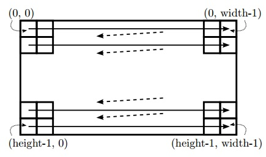
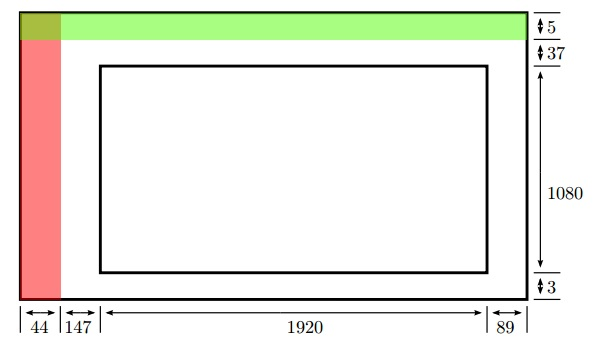
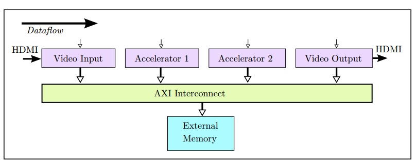
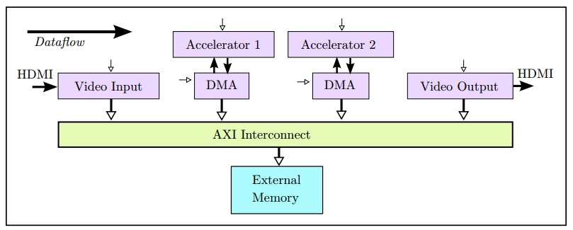
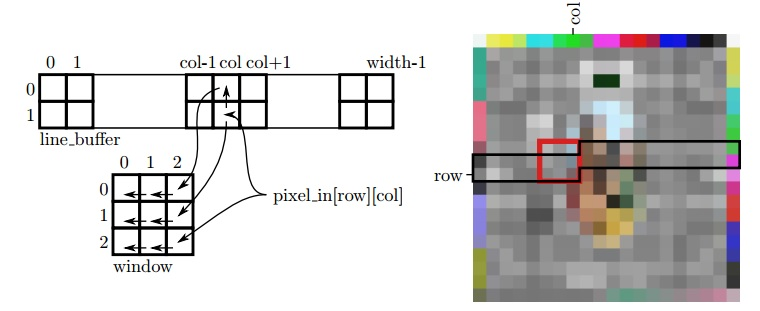
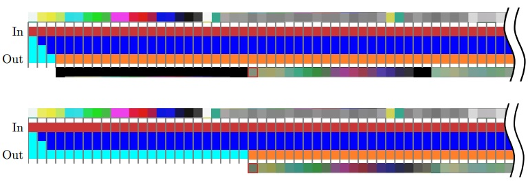

# 第九章

# 视频系统

## 9.1背景

​	视频处理是目前FPGA上常见的应用。其中一个选择FPGA处理视频应用的原因是目前的FPGA时钟处理频率可以很好地满足常见视频数据对处理速率的要求。例如，一般的高清视频格式，全高清视频格式（*1080p@60HZ）需要的处理速率是*1920（*像素/行）*1080（*行/帧）*60（*帧/秒） =  124,416,000（*像素/秒）。

​	当对数字视频流（*1080p@60HZ）进行编码时(1080p视频帧实际传输时像素大小为2200*1125，其中行2200像素 = 行同步+行消隐前肩+有效像素（1920像素）+行消隐后肩，场1125 行=场同步+场消隐前肩+有效行（1080行）+ 场消隐后肩 ），其中消隐像素也会伴随有效像素以148.5MHz（1080P@60HZ）的频率在FPGA流水线电路中进行处理。为了达到更高的处理速率可以通过在每个时钟周期内处理多个采样数据的方式实现。数字视频是如何传输的详细内容介绍将在9.1.2小节中展开。另一个选择FPGA处理视频应用需求的原因主要是因为视频按**扫描线顺序**从左上角像素到右下角像素的顺序进行处理，如图9.1所示。这种可预测的视频数据处理顺序允许FPGA在无需消耗大量存储器件的条件下构建高效的数据存储架构，从而有效地处理视频数据。这些体系结构的详细信息将在第9.2.1小节中介绍。




​                                                        

​	视频处理应用是HLS一个非常好的目标应用领域。首先，视频处理通常是可以容忍处理延迟的。尽管一些应用可能会将整体延迟限制到一帧之内，但是许多视频处理应用中是可以容忍若干帧的处理延迟。因此，在HLS中使用接口和时钟约束方式实现的高效的流水线处理，可以不用考虑处理时延问题。其次，视频算法往往非常不统一，算法一般是基于算法专家的个人喜好或擅长的方式被开发的。一般情况下它们是被使用可以快速实现和仿真的高级语言开发的。虽然全高清视频处理算法在FPGA处理系统上可以以每秒60帧处理速度运行或者是在笔记本电脑上通过使用综合的C/C++代码以每秒一帧的处理速度运行是很常见的，但是RTL级仿真时仅能一个小时一帧的速度运行。最后，视频处理算法通常以适合HLS容易实现的嵌套循环编程风格编写。这意味着来自算法开发人员编写的许多视频算法的C / C ++原型代码均可以被综合成相应的FPGA电路。

### 9.1.1 视频像素表示

​	许多视频输入和输出系统都是围绕人类视觉系统感知光线的方式进行优化的。第一个原因就是眼球中的视锥细胞对红、绿和蓝光敏感。其他颜色都可以视为红、绿和蓝色的融合。因此，摄像机和显示器模仿人类视觉系统的功能，对红、绿、蓝光采集或者显示红、绿和蓝像素，并用红色、绿色和蓝色分量的组合来表示颜色空间。最常见的情况是每个像素使用24位数据位表示，其中红绿蓝每个分量各占8位数据位，其中颜色分量的数据位的位数也存在其他情况，例如高端系统中的每个像素颜色分量可以占10位位深或甚至12位位深。

​	第二原因是人类视觉系统对亮度比对颜色更敏感。因此，在一个视频处理系统内，通常会将RGB颜色空间转换到到YUV颜色空间，它将像素描述为亮度（Y）和色度（U和V）的分量组合，其中色度分量 U和V是独立于亮度分量Y的。例如常见视频格式YUV422，就是对于4个像素点，采样4个Y的值，两个U的值，两个V的值。这种格式应用于视频压缩时的采样叫**色度子采样**。另一种常见的视频格式YUV420表示采样4个像素值由4个Y值，一个U值和一个V值组成，进一步减少了表示图像所需像素数据。视频压缩通常在YUV色彩空间中进行。

​	第三个方面是由于眼睛中的眼杆和感光部分对绿光比对红光更加敏感，并且大脑主要从绿光中获取亮度信息。因此，图像传感器和显示器采用马赛克模式，比如采样2个绿色像素和1个红像素与1个蓝像素比例的**Bayer**模式。于是在相同数量焦平面采集单元或显示器显示单元条件下系统可以采集或显示更高分辨率的图像，从而降低图像采集传感器或显示器的制造成本。

视频系统多年来一直围绕人类视觉系统进行设计。最早的黑白相机对蓝绿光敏感，以匹配眼睛对该颜色范围内亮度的敏感度。然而，不幸的是它们对红光不太敏感，因此红色（如红妆）在相机上看起来不正常。当时针对这个问题的解决方案绝对是低技术含量的：拍照时演员穿着华丽的绿色和蓝色化的妆。 

### 9.1.2 数字视频格式

​	除了表示个别的像素之外，数字视频格式必须以视频帧的形式对像素进行组织和编码。在很多情况下，通过同步或**同步**信号的方式来表示连续像素序列的视频帧开始和结束。在某些视频接口标准（如数字视频接口或**DVI**）中，同步信号使用单独的物理线路引出。在其他标准（如数字电视标准BTIR 601/656）中，同步信号的开始和结束由不会出现在视频信号中的特殊像素值表示。

​	相邻行像素之间（从左到右顺序扫描）由**水平同步信号**分隔开，且相邻行像素之间的水平同步信号由若干时钟周期的脉冲信号组成。另外，在水平同步信号和有效像素信号中间还有若干时钟周期的无效信号，这些信号称为**行前肩**和**行后肩**。同样，相邻帧信号之间（从上到下顺序扫描）由**垂直同步脉冲**分隔。每个视频帧之间有若干行有效的帧同步信号。注意，相邻帧之间的垂直同步信号仅在视频帧的开始出现。同样，帧视频信号中除了同步信号和视频有效信号外，还有无效视频行组成的**场前肩**和**场后肩**信号。另外，大多数数字视频格式包含表示有效视频像素起始的数据使能信号。因此，所有无效的视频像素一起组成**水平消隐间隔**和**垂直消隐间隔**。这些信号如图9.2所示。




​                                             

数字视频信号均是对原来电视标准的模拟信号（美国的NTSC和许多欧洲国家的PAL）通过抽样、量化和编码后形成。由于用于模拟阴极射线管扫描的硬件具有有限的电平转换速率，所以水平和垂直同步间隔的时间要满足从硬件恢复扫描到下一行的开始。同步信号由若干个时钟周期的低电平组成。另外，由于电视无法有效地显示靠近同步信号的像素，因此引入前肩信号和后肩信号，这样就可以显示更多的图片像素。即使如此，由于许多电视机都是基于**电子束扫描**原理设计的，所以其中的图像数据有20％的边框处的像素是不可见。

​	如图9.2所示，典型1080P（60Hz）视频帧共包含2200 *1125个数据采样像素点。在每秒60帧的情况下，这相当于每秒总共148.5百万的采样像素点。这比1080P（60Hz）帧中的有效视频像素的平均速率（1920 * 1080 * 60 =每秒124.4百万像素）高很多。现在的大多数FPGA都可以满足以这个时钟速率进行高效的处理，并且是在一个时钟周期进行一次采样的方式下运行的。对于更高分辨率的处理系统需求，如4K或2K的数字影院，或者每秒120帧甚至240帧的处理需求，就需要一个时钟周期采样更多像素点，通过增加数据处理的吞吐量方式来运行。注意，我们通常可以通过在HLS中展开循环的方式来生成此类结构（请参见1.4.2小节）。同样，当处理低分辨率和低帧率需求时，优选的方案是采用操作共享的方式，多个时钟周期去处理一次采样。这样的处理结构是通过指定循环的处理间隔方式实现。

```c
#include ”video_common.h” 
unsigned char rescale(unsigned char val, unsigned char offset, unsigned char scale) {
    return ((val − offset) ∗ scale) >> 4;
}

rgb_pixel rescale_pixel(rgb_pixel p, unsigned char offset, unsigned char scale) {
    #pragma HLS pipeline
    p.R = rescale(p.R, offset, scale);
    p.G = rescale(p.G, offset, scale);
    p.B = rescale(p.B, offset, scale);
    return p;
}

void video_filter_rescale(rgb_pixel pixel_in[MAX_HEIGHT][MAX_WIDTH],
rgb_pixel pixel_out[MAX_HEIGHT][MAX_WIDTH],
unsigned char min, unsigned char max) {
    #pragma HLS interface ap_hs port = pixel_out
    #pragma HLS interface ap_hs port = pixel_in
    row_loop:
    for (int row = 0; row < MAX_WIDTH; row++) {
        col_loop:
        for (int col = 0; col < MAX_HEIGHT; col++) {
            #pragma HLS pipeline
            rgb_pixel p = pixel_in[row][col];
            p = rescale_pixel(p,min,max);
            pixel_out[row][col] = p;
		}

	}

}
```

​                                                                     图9.3 简单视频滤波器的实现代码

​	例如，在图9.3中代码展示了一个简单的视频处理应用程序，程序中执行每次循环的II = 1(Initiation interval),也就是一个时钟周期处理一次采样数据。代码中采用嵌套循环的方式是按照图9.1中所示的扫描线顺序处理图像中的像素。II = 3的设计方式可以通过共享计算组件的方式来减少资源使用量。通过设置内层循环展开因子为2和输入输出数组拆分因子为2就可以满足一个时钟处理两个像素。这种例子相对简单，因为每个组件和每个像素的处理是相对独立的。更复杂的功能可能不会因为资源共享而处理更方便，也可能无法同时处理多个像素。


```c++
void video_filter(rgb_pixel pixel_in[MAX_HEIGHT][MAX_WIDTH],
rgb_pixel pixel_out[MAX_HEIGHT][MAX_WIDTH]) {
	#pragma HLS interface ap_memory port = pixel_out // The default
	#pragma HLS interface ap_memory port = pixel_in // The default             
```

高速计算机视觉应用是需要满足每秒处理10000帧的200*180像素的视频帧的速度要求。这样的应用通常是使用一个高速图像传感器直接和FPGA直接连接，并且中间不需要有同步信号。在这种情况下，你会每个时钟周期内进行多少次采样处理呢？FPGA可以很好的完成处理么？答案是你可以使用HLS编写嵌套循环的结构来完成这样的设计。

### 9.1.3 视频处理系统架构

​	到目前为止，我们专注于构建视频处理应用部分的程序而不关心如何将其整合到一个大的系统程序中去。在很多情况下，如图9.1.2中示例代码，大部分像素处理发生在循环内，并且当循环运行时每个时钟周期仅处理一个像素。在本节中，我们将讨论讲视频处理部分程序集成到大的系统程序中的情况。

​	默认情况下，Vivado@HLS软件会将代码中的函数数组接口综合成硬件的存储器接口。其中，存储器写数据接口由地址总线、数据总线和写使能信号线组成。存储器每次读取和写入数据均有相应地址变化，并且数据读取和写入时间固定。如图9.4所示，将这种接口与片上存储资源Block RAM资源集成在一起使用很简单方便。但是即使在大容量的芯片，片上Block RAM资源也是很稀缺的，因此如果存储大容量的视频资源会很快消耗完片上Block RAM资源。

针对24位像素位深的1920x1080视频帧，芯片需要消耗多少BlockRAM资源才能完成存储存一帧视频帧？片上Block RAM资源最多又能存储多少帧呢？





```c
void video_filter(pixel_t pixel_in[MAX_HEIGHT][MAX_WIDTH],
pixel_t pixel_out[MAX_HEIGHT][MAX_WIDTH]) {
   		#pragma HLS interface m_axi port = pixel_out
   		#pragma HLS interface m_axi port = pixel_in                                            
```

​	通常，大部分视频系统更好的选择是将视频帧存储在外部存储器中，比方说DDR。在图9.5中展示了系统与外部存储器典型系统集成模式。在FPGA内部，**外部存储器的控制器**（MIG）集成了ARM AXI4标准化从接口与FPGA内的其他模块进行通信。FPGA内的其它模块使用AXI4主接口或者是通过专门的**AXI4内部互联模块**与外部存储器的AXI4从接口相连。AXI内部互联模块允许多个主设备模块访问多个从设备模块。该架构抽象了外部存储器的操作细节，允许在无需修改FPGA设计中其它模块的情况下，允许不同外部存储器模块和标准互换使用。

​	尽管大多数处理器都使用高速缓存，从而高性能处理数据。但通常情况下，如图9.5所示，基于FPGA实现的视频处理系统，无需片上高速缓存。在处理器系统中，高速缓存可以提供对先前访问的数据更低时延的访问，并通过始终读取或写入完整的高速缓存行来提高对外部存储器访问的带宽。一些处理器甚至还使用更复杂的数据处理机制，如预取和推测读取，以减少对外部存储器的访问时延和增加对外部存储器的访问带宽。对于大多数基于FPGA的视频处理系统，因为大多数视频算法访问外部存储器是可预测的，所以使用线性缓冲区和窗口缓冲区可以一次从外部缓冲区中读取多个数据。另外,当以猝发模式对外部存储器访问时，Vivado@HLS能够提前调度地址变换，避免读取数据时拖延计算。





```c
void video_filter(pixel_t pixel_in[MAX_HEIGHT][MAX_WIDTH],
pixel_t pixel_out[MAX_HEIGHT][MAX_WIDTH]) {
  #pragma HLS interface s_axi port = pixel_out
  #pragma HLS interface s_axi port = pixel_in
```


```c
void video_filter(pixel_t pixel_in[MAX_HEIGHT][MAX_WIDTH],
pixel_t pixel_out[MAX_HEIGHT][MAX_WIDTH]) {
	#pragma HLS interface ap_hs port = pixel_out
	#pragma HLS interface ap_hs port = pixel_in
void video_filter(hls::stream<pixel_t> &pixel_in,
hls::stream<pixel_t> &pixel_out) {
```

​                                                    图9.7: HLS中流接口的代码实现方式


​	如图9.6所示为另一种存储器体系架构。在这种架构中，算法处理模块通过外部直接存储器（DMA）与外部存储器连接，DMA完成与外部存储控制器（MIG）之间地址转换的细节操作。算法处理模块可以以AXI总线数据流（AXIS）的形式将数据传输给DMA控制器。DMA假设数据是算法处理模块生成的，并将数据写入外部存储器。在Vivado@HLS中，有多种编码方式可以将代码中的数组接口综合成AXIS流接口，如图9.7所示是其中一种。在这种情况下，C代码与前面看到的代码相同，但接口约束指令不同。另外一种代码实现方法是使用hls::stream<>方式显式建立总线流接口。无论那种情况都必须注意，DMA中生成数据的顺序要与C代码中访问数据的顺序相同。

​	AXIS数据流接口的一个优点是它允许在设计系统中，采用多个算法处理模块级联的方式，并且不需要在外部存储器中存储算法处理计算中间结果。在一些应用例子中，如图9.8所示，FGPA系统在没有外部存储器的情况下，将从输入接口（如HDMI）上接收到的像素数据处理后直接将它们发送到输出接口。这样的设计通常要求算法处理模块的吞吐量必须达到需求，以满足外部接口严格实时约束的要求。当一些复杂的算法构建时，系统难以保证其数据吞吐量需求，因此系统如果至少能提供一帧缓冲区，就可以为算法构建提供更大的灵活性。当输入和输出像素速率不同或者可能不相关时（例如接收任意输入视频格式并输出不同任意视频格式的系统），帧缓冲可以起到简化构建系统的作用。


```c
void video_filter(pixel_t pixel_in[MAX_HEIGHT][MAX_WIDTH],
 pixel_t pixel_out[MAX_HEIGH][MAX_HEIGHT]) {
		#pragma HLS interface ap_hs port = pixel_out
		#pragma HLS interface ap_hs port = pixel_in
```

## 9.2实现

​	当一个系统实际处理视频数据时，一般从视频处理算法实现角度来进行系统分解集成。在本章的剩余部分，我们将假设输入数据是按照流的方式送入系统，并且按照扫描线的顺序进行处理的。采用HLS开发，我们不关注代码RTL级具体实现方式，只关注HLS设计能满足所需要的性能指标要求即可。

### 9.2.1 行缓冲和帧缓冲

​	在视频处理算法中，通常计算一个输出像素的值时需要输入像素及其周围的像素的值做参考，我们把储存计算所需要的输入像素值的区域叫**窗口**。从概念上讲，按照窗口大小去Z型扫描图片，然后根据扫描到的像素值计算出输出结果就可以。如图9.9所示示例代码中，示例代码是针对视频帧进行二维滤波。示例代码中在计算每一个输出像素结果前需要从输入视频帧中读取相应的窗口像素数据（存储在数组中）。

 在图9.9中，代码中包含的`int wi =row + i – 1;int wj = col +j -1;`, 解释这些表达式为什么包含”-1”这一项。提示：如果滤波器核换成7×7，而不是3×3，”-1”这个数字项会改变么？ 

​	注意，在此代码中，每计算一个输出像素值，必须多次读入像素并填充到窗口缓冲区中。如果每个时钟周期只能执行一次读操作，示例代码的执行性能会受限于读入像素速率大小。因此示例代码基本上是图1.8中所示一维滤波器的二维版本。另外，因为输入像素不是以正常扫描线顺序读取的，所以接口约束也只有有限的几个可选。（本主题将在9.1.3小节中更详细讨论）。

​	仔细观察相邻的窗口缓冲区中缓冲的数据，你会发现缓冲的数据高度重叠，这意味着相邻窗口缓冲区之间数据更高的依存性。这也意味来自输入图像的像素可以被本地缓存或者高速缓存存储，以备数据被多次访问使用。通过重构代码来每次只读取输入像素一次并存储在本地缓冲区中，这样可以使系统性能得到更好的表现。在视频系统中，由于本地缓冲区存储窗口周围多行视频像素，所以本地缓冲区也称为**线性缓冲区**。线性缓冲区通常使用Block RAM(BRAM)资源实现，而窗口缓冲区则使用触发器（FF）资源实现。图9.10所示是使用线性缓冲区重构的代码。注意，对于N×N图像滤波器，只需要N-1行存储在线性缓冲区中即可。

```c
rgb_pixel filter(rgb_pixel window[3][3]) {
  const char h[3][3] = {{1, 2, 1}, {2, 4, 2}, {1, 2, 1}};
	int r = 0, b = 0, g = 0;
i_loop: for (int i = 0; i < 3; i++) {
 j_loop: for (int j = 0; j < 3; j++) {
      r += window[i][j].R ∗ h[i][j];
      g += window[i][j].G ∗ h[i][j];
      b += window[i][j].B ∗ h[i][j];
	}	
}
  rgb_pixel output;
  output.R = r / 16;
  output.G = g / 16;
  output.B = b / 16;
  return output;
}
void video_2dfilter(rgb_pixel pixel_in[MAX_HEIGHT][MAX_WIDTH],
		rgb_pixel pixel_out[MAX_HEIGHT][MAX_WIDTH]) {
    rgb_pixel window[3][3];
row_loop: for (int row = 0; row < MAX_HEIGHT; row++) {
 col_loop: for (int col = 0; col < MAX_WIDTH; col++) {
    #pragma HLS pipeline
    for (int i = 0; i < 3; i++) {
      for (int j = 0; j < 3; j++) {
          int wi = row + i − 1;
          int wj = col + j − 1;
          if (wi < 0 || wi >= MAX_HEIGHT || wj < 0 || wj >= MAX_WIDTH) {
          window[i][j].R = 0;
          window[i][j].G = 0;
          window[i][j].B = 0;
      } else			
      		window[i][j] = pixel_in[wi][wj];
      }
    }
if (row == 0 || col == 0 || row == (MAX_HEIGHT − 1) || col == (MAX_WIDTH − 1)) {
          pixel_out[row][col].R = 0;
          pixel_out[row][col].G = 0;
          pixel_out[row][col].B = 0;
} else
		pixel_out[row][col] = filter(window);
		}
	}
}
```

​                                               图 9.9: 没有使用线性缓冲区的2D滤波代码


​	如图9.10所示代码，是使用线性缓冲区和窗口缓冲区方式实现的，其中代码实现过程如图9.11所示。代码每次执行一次循环时，窗口会移动一次，使用来自于1个输入像素和两个来自于行缓冲区缓存的像素来填充窗口缓冲区。另外，输入的新像素被移入线性缓冲区，准备被下一行的窗口运算过程所使用。请注意，由于为了每个时钟周期处理一个像素并输出结果，所以系统必须在每个时钟周期内完成对窗口缓冲区数据的读取和写入。另外，当展开”i”循环后，对于窗口缓冲区数组而言，每个数组索引都是一个常量。在这种情况下，Vivado@HLS将转换数组中的每个元素成一个标量变量（一个成为**标量化**的过程）。窗口数组中的元素随后使用触发器(FF)编译实现。同样，线性缓冲区的每一行数据都会被访问两次（被读取一次和写入一次）。示例代码中明确约束行缓冲区中每一行数组元素被分割成到一块单独存储区中。根据MAX WIDTH的可能取值情况，最后决定使用一个或者多个Block RAM实现。注意，每个Block RAM可在每个时钟周期支持两次独立访问。

线性缓冲区是应用于模块式计算的**重用缓冲区**的一种特殊例子。如图9.9中所示，重用缓冲区和线性缓冲区的高级综合是目前一个热点研究领域。参考[[8](./BIBLIOGRAPHY.md#8), [31](./BIBLIOGRAPHY.md#31)]。

Vivado@HLS包含hls::linebuffer<> 和hls::window buffer<>类，它们可以简化窗口缓冲区和行缓冲区的管理。

对于3×3的图像滤波器核，则存储每个像素占用4字节的1920×1080图像的一行数据需要使用多少个FPGA片上Block RAM?

### 9.2.2 因果滤波器

​	图9.10中实现的滤波器是每个时钟周期读取一个输入像素，计算出一个输出像素。该滤波器实现原理与图9.9中所示不完全相同。输出结果是从先前读取像素的窗口缓冲区中数据计算出来的。窗口缓冲区中取数顺序是“向上和向左”。因此，输出图像相对于输入图像是“向下和向右”移动的。这种情况类似于信号处理中的因果滤波器和非因果滤波器的原理。大多数信号处理理论的重点是因果滤波器。因为只有因果滤波器对于时间采样信号（例如，其中$x[n] = x(n*T)$和​$y[n] = y(n*T)$）才有实用价值。

在**因果**滤波器$h[n]$中，$\forall k < 0,h[k] = 0$。虽然，有限滤波器$h[n]$不是因果滤波器，但是可以通过延时方法使得而被$\wedge h[n] = h[n - D]$转换为因果滤波器$h[n]$。新滤波器$\wedge y = x \otimes  \wedge h$的输出与旧滤波器$y = x \otimes h$的延时输出相同。具体而言，$ \wedge y = y[n - D]$。

```c
void video_2dfilter_linebuffer(rgb_pixel pixel_in[MAX_HEIGHT][MAX_WIDTH],
                               rgb_pixel pixel_out[MAX_HEIGHT][MAX_WIDTH]) {
#pragma HLS interface ap_hs port=pixel_out
#pragma HLS interface ap_hs port=pixel_in
rgb_pixel window[3][3];
rgb_pixel line_buffer[2][MAX WIDTH];
#pragma HLS array_partition variable=line_buffer complete dim=1
row_loop: for (int row = 0; row < MAX_HEIGHT; row++) {
	col_loop: for (int col = 0; col < MAX_WIDTH; col++) {
	#pragma HLS pipeline
    for(int i = 0; i < 3; i++) {
        window[i][0] = window[i][1];
        window[i][1] = window[i][2];
}
      window[0][2] = (line_buffer[0][col]);
      window[1][2] = (line_buffer[0][col] = line_buffer[1][col]);
      window[2][2] = (line_buffer[1][col] = pixel_in[row][col]);
      if (row == 0 || col == 0 ||
      row == (MAX_HEIGHT − 1) ||
      col == (MAX_WIDTH − 1)) {
      pixel_out[row][col].R = 0;
      pixel_out[row][col].G = 0;
      pixel_out[row][col].B = 0;
} else {
	  pixel_out[row][col] = filter(window);
			}
		}
	}
}	
```

 							图 9.10: 使用线性缓冲区实现2D滤波器的代码






通过卷积的定义证明前面原理：

 $$y = x \otimes h:y[n] = \sum\limits_{k =  - \infty }^\infty  {x[k]*h[n - k]} $$

​ 

​	就本书而言，大多数变量不是时间采样信号和单输入单输出系统。对于设计时间采样信号的系统，在使用HLS开发过程中可以进行时序约束处理。只要系统能达到所需的任务延迟，那么就认为系统设计是正确的。

​	在大多数视频处理算法中，在上文代码中所引入的空间位移不是预期的，是需要被消除的。虽然有很多种修改代码的方法来解决这个问题，但是一种常见的方式是**扩展迭代域**。这种技术是通过增加少量的循环边界，以便第一次循环迭代就读取第一个输入像素，但是第一个输出像素直到等到后面的迭代空间才写出。修改后的版本滤波器代码如图9.12所示。代码原理如图9.14所示，和图9.10中原始缓冲区中代码相同。使用HLS编译后，可以看出数据依赖性以完全相同的方式得到满足，并且待综合的代码是硬件可实现的。

### 9.2.3 边界条件

​	在大多数情况下，计算缓冲区窗口只是输入图像的一个区域。然而，在输入图像的边界区域，滤波器进行计算的范围将超过输入图像的边界。根据不同应用的要求，会有很多不同的方法来解决图像边界处的计算问题。也许最简便的方法来解决边界问题就是忽略边界，这样输出的图像就会比输入的图像长宽各少滤波器核大小。但是在输出图像大小固定的应用中，如数字电视，这种方法就行不通了。

```c
void video_2dfilter_linebuffer_extended(
  	rgb_pixel pixel_in[MAX_HEIGHT][MAX_WIDTH],
	rgb_pixel pixel_out[MAX_HEIGHT][MAX_WIDTH]) {
    #pragma HLS interface ap_hs port=pixel_out
    #pragma HLS interface ap_hs port=pixel_in
    rgb_pixel window[3][3];
    rgb_pixel line_buffer[2][MAX_WIDTH];
    #pragma HLS array_partition variable=line_buffer complete dim=1
    row_loop: for(int row = 0; row < MAX_HEIGHT+1; row++) {
     col_loop: for(int col = 0; col < MAX_WIDTH+1; col++) {
      #pragma HLS pipeline II=1
      rgb_pixel pixel;
      if(row < MAX_HEIGHT && col < MAX_WIDTH) {
      	pixel = pixel_in[row][col];
        }
      for(int i = 0; i < 3; i++) {
        window[i][0] = window[i][1];
        window[i][1] = window[i][2];
      }
      if(col < MAX_WIDTH) {
        window[0][2] = (line_buffer[0][col]);
        window[1][2] = (line_buffer[0][col] = line_buffer[1][col]);
        window[2][2] = (line_buffer[1][col] = pixel);
      }
      if(row >= 1 && col >= 1) {
          int outrow = row−1;
          int outcol = col−1;
          if(outrow == 0 || outcol == 0 ||
              outrow == (MAX_HEIGHT−1) || outcol == (MAX_WIDTH−1)) {
                  pixel_out[outrow][outcol].R = 0;
                  pixel_out[outrow][outcol].G = 0;
                  pixel_out[outrow][outcol].B = 0;
              } else {
             	 pixel_out[outrow][outcol] = filter(window);
              }
          }
      	}
      }
}
```

​			图 9.12: 使用线性缓冲区并且循环迭代范围扩展为1时实现2D的滤波器代码





 							  

另外，当处理大量大小略微不同的图片时，需要一系列大小的滤波器核来进行处理，这种情况就复杂了。图9.10中的代码展示，输出图像通过在边界处填充已知值的像素（一般填充黑色）来达到与输入图像大小相同。或者通过其他方式来合成缺失的值。

* 缺少的输入值可以用常量来填充；
* 可以从输入图像的边界像素处填充缺少的输入值；
* 缺失的输入值可以在输入图片内部像素中进行重构。

 当然，也存在更复杂和更计算密集的方案。图9.16中展示了一种处理边界条件的方案。此方案是通过计算每个像素在窗口缓冲区中的偏移地址方法。这种方案的一个明显的缺点就是每次从窗口缓冲区中读取的地址都是变化的地址。因此，在计算滤波之前，这个变量会导致多路复用。对于N×N的抽头滤波器，针对N个输入将会消耗大约N×N个多路复用器。对于滤波器而言，多路复用器占滤波器资源消耗的大部分。另一种处理数据写入窗口缓冲区时的边界条件是以规则模式移动窗口缓冲区。在这种情况下，只消耗N个多路复用器，而不是N*N个，从而是资源消耗量降低很多。

修改图9.16中的代码，从窗口缓冲区中读取数据使用常量地址。你节省了多少硬件资源？ 

## 9.3结论

​	视频处理是一种常见的非常适合使用HLS实现的FPGA应用。大多数视频处理算法有一个共同特点是数据局部性，即可以在使用少量的外部存储器访问的情况下，能够实现流式传输和本地缓存的应用。

```c
void video 2dfilter linebuffer extended constant(
  rgb pixel pixel in[MAX HEIGHT][MAX WIDTH], rgb pixel pixel out[MAX HEIGHT][MAX WIDTH]) {
  #pragma HLS interface ap hs port=pixel out
  #pragma HLS interface ap hs port=pixel in
  rgb pixel window[3][3];
  rgb pixel line buffer[2][MAX WIDTH];
  #pragma HLS array partition variable=line buffer complete dim=1
  row loop: for(int row = 0; row < MAX HEIGHT+1; row++) {
	col loop: for(int col = 0; col < MAX WIDTH+1; col++) {
	#pragma HLS pipeline II=1
	rgb pixel pixel;
	if(row < MAX HEIGHT && col < MAX WIDTH) {
		pixel = pixel in[row][col];
	}
	for(int i = 0; i < 3; i++) {
		window[i][0] = window[i][1];
		window[i][1] = window[i][2];
	}
	if(col < MAX WIDTH) {
		window[0][2] = (line buffer[0][col]);
		window[1][2] = (line buffer[0][col] = line buffer[1][col]);
		window[2][2] = (line buffer[1][col] = pixel);
	}
	if(row >= 1 && col >= 1) {
		int outrow = row−1;
		int outcol = col−1;
		rgb pixel window2[3][3];
		for (int i = 0; i < 3; i++) {
			for (int j = 0; j < 3; j++) {
				int wi, wj;
				if (i < 1 − outrow) wi = 1 − outrow;
				else if (i >= MAX HEIGHT − outrow + 1) wi = MAX HEIGHT − outrow;
				else wi = i;
				if (j < 1 − outcol) wj = 1 − outcol;
				else if (j >= MAX WIDTH − outcol + 1) wj = MAX WIDTH − outcol;
				else wj = j;
				window2[i][j] = window[wi][wj];
	}
}
		pixel out[outrow][outcol] = filter(window2);
			}
		}
  	}
}
```


图 9.16: 使用线性缓冲区核常量边界来实现处理边界条件的代码，这种方法处理消耗硬件资源成本很大