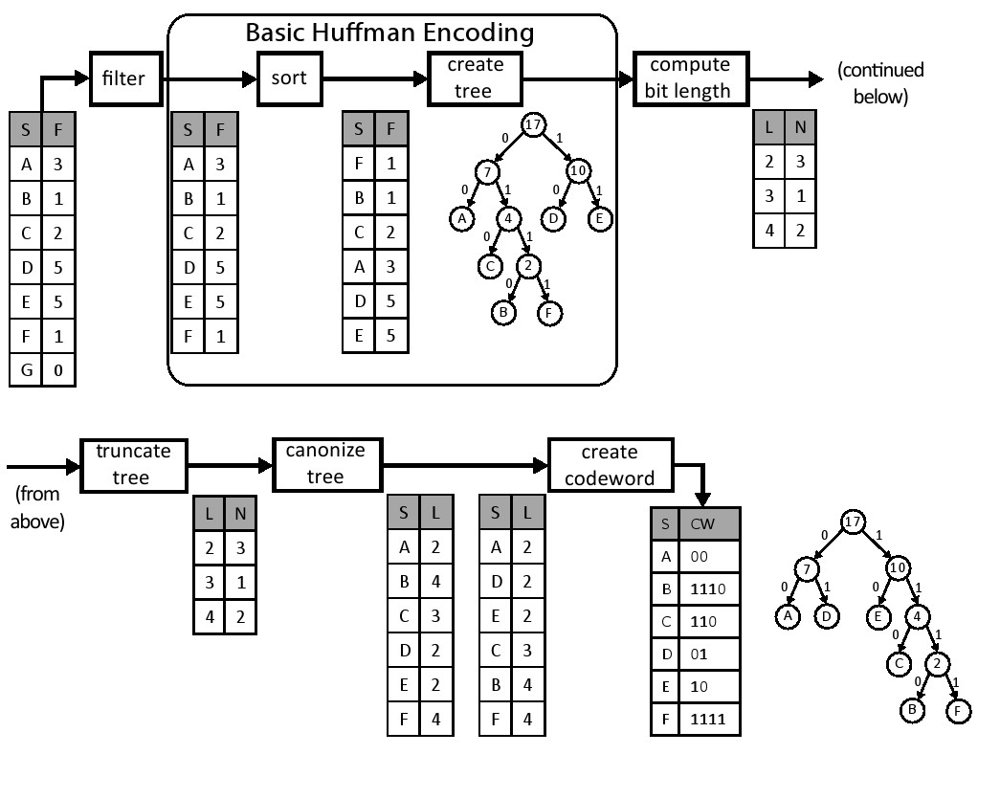
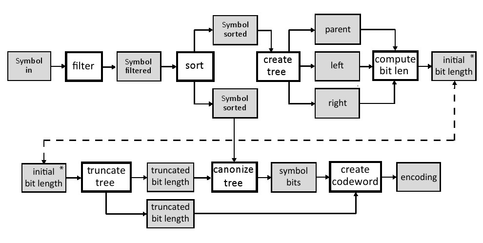
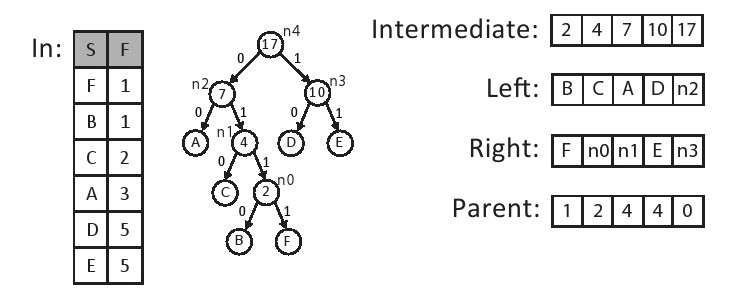

# 第十一章 霍夫曼编码
## 11.1 背景

无损数据压缩是高效数据存储中的一个关键要素，而霍夫曼编码则是其中最流行的可变长度编码算法[[33](./BIBLIOGRAPHY.md#33)]。 给定一组数据符号以及它们出现的频率，霍夫曼编码将以更短的代码分配给更频繁（出现的）符号这种方式生成码字来最小化平均代码长度。由于它保证了最优性，霍夫曼编码已被各种应用广泛采用[[25](./BIBLIOGRAPHY.md#25)]。 在现代多级压缩设计中，它经常用作系统的后端，来提高特定领域前端的压缩性能，如GZIP[[23](./BIBLIOGRAPHY.md#23)]，JPEG[[57](./BIBLIOGRAPHY.md#57)]和MP3[[59](./BIBLIOGRAPHY.md#59)]。 尽管算术编码[[61](./BIBLIOGRAPHY.md#61)]（霍夫曼编码的一个广义版本，它将整个消息转换为单个数字）可以对大多数场景实现更好的压缩，但是由于算术编码专利问题[[38](./BIBLIOGRAPHY.md#38)]，霍夫曼编码通常成为许多系统的首选算法。

Canonical霍夫曼编码与传统的霍夫曼编码相比有两大优势。 在基本霍夫曼编码中，编码器将完整霍夫曼树结构传递给解码器。 因此，解码器必须遍历树来解码每个编码的符号。 另一方面，Canonical霍夫曼编码仅将每个符号的位数传送给解码器，然后解码器重构每个符号的码字。这使得解码器在内存使用和计算需求中更加高效。 因此，我们专注于Canonical霍夫曼编码。

在基本的霍夫曼编码中，解码器通过遍历霍夫曼树，从根开始直到它到达叶节点来解压缩数据。这种方式有两个主要缺点：第一、它需要存储整个霍夫曼树，从而增加了内存使用量。此外，为每个符号遍历树的计算成本是很高的。Canonical霍夫曼编码通过使用标准的规范格式创建代码来解决这两个问题。使用Canonical编码的好处在于：我们只需要传输每个霍夫曼码字的长度。一个Canonical霍夫曼代码具有两个额外的属性：首先，较长代码比相同长度前缀的较短代码具有更高的数值。其次，具有相同长度的代码随着符号值的增加而增加。这意味着如果我们知道每个代码长度的起始符号，我们可以很容易重建Canonical霍夫曼编码。霍夫曼树本质上等同于“排序”版本的原始霍夫曼树，以便更长的码字在树的最右边的分支上，树的同一级别上的所有节点按照符号的顺序排序。




图11.1展示了创建Canonical霍夫曼编码的过程。filter模块仅传递非零频率的符号。sort模块根据它们的频率按升序重新排列符号。接下来，create tree模块使用以下三个步骤构建霍夫曼树：

1. 使用两个最小频率节点作为初始子树并通过求它们频率的和来生成新的父节点；
2. 它将新的中间节点添加到列表中，并再次分类;
3. 它从列表中选择两个最小元素并重复这些步骤直到剩下最后一个元素为止。

结果是霍夫曼树中的每个叶节点代表可以被编码的符号，并且每个内部节点被标记为该子树节点的频率。通过将树中的左边和右边与位0和1相关联，我们可以根据从根节点到达它的路径来确定每个符号唯一的码字。例如，A的码字是00，而B的码字是1110。
这样就完成了基本的霍夫曼编码过程，但是对于创建Canonical霍夫曼树这并不是必须的。

为了创建霍夫曼树，我们做了几个额外的转换。 首先，compute bit len模块计算每个码字的位长度，然后对每个长度的频率进行计数，结果是一个码字长度的直方图（见第8.2节）。 在这个例子中，我们有三个符号（A，D，E），代码长度为2。因此，计算的直方图表中包含了位置2中的数值3。接下来，truncate tree模块重新平衡霍夫曼树以避免出现过长的码字。这可以在编码时间稍微增加的代价下提高解码器的速度。 这在图11.1的示例中不是必需的。我们设定了树的最大高度为27。 最后，canonize tree模块创建两个排序表，第一个表格包含了符号和按符号排序的符号长度。第二个表格包含了符号和按长度排序的符号长度。 这些表格简化了为每个符号创建Canonical霍夫曼码字的过程。

create codeword模块通过遍历已排序的表创建Canonical霍夫曼码字表。从排序表中的第一个码字开始，它被分配了适当长度全零码字。每个具有相同位长度的后续符号被赋值为随后的码字，它是在前一个码字上简单地加1而形成的。在我们的例子中，符号A，D和E的位长度均是l = 2，而分配的码字分别是A = 00，D = 01，E = 10。 请注意符号是按字母顺序考虑的，这是使树规范化所必需的。这个过程一直持续直到我们得到一个需要一个更大长度的码字，在这种情况下，我们不仅增加了先前的码字，而且还向左移位以生成正确长度的码字。在这个例子中，下一个符号是C，长度为3，其接收的码字C =（10 + 1）<< 1 = 11 << 1 = 110。接下来，下一个符号是B，长度为4.再一次，我们增加和移位一次。于是B的代码字为B =（110 + 1）<< 1 = 1110.符号F的最终码字为F= 1110 + 1 = 1111。详见第11.2.7章。

Canonical霍夫曼代码的创建包括许多复杂的和内在的顺序计算。 例如，create_tree模块需要跟踪被创建的子树的正确顺序、需要仔细的内存管理，可以被利用的并行性非常有限。下面我们来讨论使用Vivado HLS进行Canonical霍夫曼编码设计的硬件架构和实现。

```c

#include "huffman.h"
#include "assert.h"
void huffman_encoding(
    /* input */ Symbol symbol_histogram[INPUT_SYMBOL_SIZE],
    /* output */ PackedCodewordAndLength encoding[INPUT_SYMBOL_SIZE],
    /* output */ int *num_nonzero_symbols) {
    #pragma HLS DATAFLOW

    Symbol filtered[INPUT_SYMBOL_SIZE];
    Symbol sorted[INPUT_SYMBOL_SIZE];
    Symbol sorted_copy1[INPUT_SYMBOL_SIZE];
    Symbol sorted_copy2[INPUT_SYMBOL_SIZE];
    ap_uint<SYMBOL_BITS> parent[INPUT_SYMBOL_SIZE-1];
    ap_uint<SYMBOL_BITS> left[INPUT_SYMBOL_SIZE-1];
    ap_uint<SYMBOL_BITS> right[INPUT_SYMBOL_SIZE-1];
    int n;

    filter(symbol_histogram, filtered, &n);
    sort(filtered, n, sorted);

    ap_uint<SYMBOL_BITS> length_histogram[TREE_DEPTH];
    ap_uint<SYMBOL_BITS> truncated_length_histogram1[TREE_DEPTH];
    ap_uint<SYMBOL_BITS> truncated_length_histogram2[TREE_DEPTH];
    CodewordLength symbol_bits[INPUT_SYMBOL_SIZE];

    int previous_frequency = -1;
 copy_sorted:
    for(int i = 0; i < n; i++) {
        sorted_copy1[i].value = sorted[i].value;
        sorted_copy1[i].frequency = sorted[i].frequency;
        sorted_copy2[i].value = sorted[i].value;
        sorted_copy2[i].frequency = sorted[i].frequency;
        // std::cout << sorted[i].value << " " << sorted[i].frequency << "\n";
        assert(previous_frequency <= (int)sorted[i].frequency);
        previous_frequency = sorted[i].frequency;
    }

    create_tree(sorted_copy1, n, parent, left, right);
    compute_bit_length(parent, left, right, n, length_histogram);

#ifndef __SYNTHESIS__
    // Check the result of computing the tree histogram
    int codewords_in_tree = 0;
 merge_bit_length:
    for(int i = 0; i < TREE_DEPTH; i++) {
        #pragma HLS PIPELINE II=1
        if(length_histogram[i] > 0)
            std::cout << length_histogram[i] << " codewords with length " << i << "\n";
        codewords_in_tree += length_histogram[i];
    }
    assert(codewords_in_tree == n);
#endif

        truncate_tree(length_histogram, truncated_length_histogram1, truncated_length_histogram2);
    canonize_tree(sorted_copy2, n, truncated_length_histogram1, symbol_bits);
    create_codeword(symbol_bits, truncated_length_histogram2, encoding);

    * num_nonzero_symbols = n;
}
```


有些额外的数据复制可能是不必要的，这是因为我们使用了dataflow指令，这给子函数间变量的传递起到了限制作用。特别是，部分函数之间，生产者和消费者的数据关系，有一些严格的规则， 这就要求我们复制一些数据。 例如，我们创建了数组parent，Left和Right的两个副本。我们也与数组截短位长度相同。 前者是在top霍夫曼编码函数的for循环中完成的;后者是在canonize tree函数内完成的。


dataflow指令限制函数中的信息流动。许多限制强化了子函数之间严格的生产者和消费者关系。一个这样的限制是，一个数组应该只由一个函数写入，并且它只能由一个函数读取。即它只能作为从一个函数的输出到另一个函数的输入。如果多个函数从同一数组中读取，Vivado R.HLS将综合代码，但会发出警告并且不会使用数据流水线式架构。因此，使用数据流模式通常需要将数据复制到多个数组中。如果一个函数试图从一个数组读写，而这个数组同时被另一个函数访问，则会出现类似的问题。在这种情况下，必须保留函数内部的数据一个额外的内部副本。我们将讨论这两个要求以及如何遵守它们，正如我们在本章其余部分所述的那样。


## 11.2 实现
Canonical霍夫曼编码过程本质上是被分成子函数。因此，我们可以逐一处理这些子函数。 在我们这样做之前，我们应该考虑这些函数的每个接口。
图11.4显示了函数及其输入和输出的数据。 为了简单起见，它只显示与数组的接口，由于它们很大，我们可以假设它们存储在RAM块中（BRAMs）。 在我们描述这些函数以及他们的输入和输出之前，我们需要讨论huffman.h中定义的常量，自定义数据类型和函数接口。
图11.3显示了这个文件的内容。

INPUT_SYMBOL_SIZE参数定义了作为编码输入的符号的最大数量。在这种情况下，我们将其设置为256，从而启用8位ASCII数据的编码。 TREE_DEPTH参数指定初始霍夫曼树生成期间单个代码字长度的上限。当霍夫曼树在truncate_tree函数中重新平衡时，CODEWORD_LENGTH参数指定了目标树的高度。 CODEWORD_LENGTH_BITS常量决定编码码字长度所需的位数，等于log2[CODEWORD_LENGTH]，在这种情况下也即等于5。

```c
include "ap_int.h"

// input number of symbols
const static int INPUT_SYMBOL_SIZE = 256;

// upper bound on codeword length during tree construction
const static int TREE_DEPTH = 64;

// maximum codeword tree length after rebalancing
const static int MAX_CODEWORD_LENGTH = 27;

// Should be log2(INPUT_SYMBOL_SIZE)
const static int SYMBOL_BITS = 10;

// Should be log2(TREE_DEPTH)
const static int TREE_DEPTH_BITS = 6;

// number of bits needed to record MAX_CODEWORD_LENGTH value
// Should be log2(MAX_CODEWORD_LENGTH)
const static int CODEWORD_LENGTH_BITS = 5;

// A marker for internal nodes
const static ap_uint<SYMBOL_BITS> INTERNAL_NODE = -1;

typedef ap_uint<MAX_CODEWORD_LENGTH> Codeword;
typedef ap_uint<MAX_CODEWORD_LENGTH + CODEWORD_LENGTH_BITS> PackedCodewordAndLength;
typedef ap_uint<CODEWORD_LENGTH_BITS> CodewordLength;
typedef ap_uint<32> Frequency;

struct Symbol {
	 ap_uint<SYMBOL_BITS> value;
	 ap_uint<32> frequency;
};

void huffman_encoding (
	Symbol in[INPUT_SYMBOL_SIZE],
	PackedCodewordAndLength encoding[INPUT_SYMBOL_SIZE],
	int *num_nonzero_symbols
);
```
如图11.3：顶层函数huffman_encoding的参数、自定义数据类型和函数接口。



我们创建一个自定义数据类型Symbol来保存对应于输入值和它们的频率的数据。 该数据类型在需要访问这些信息的编码过程中被用于filter, sort，以及其它一些函数。数据类型有两个字段：数值和频率。 在这里我们假定被编码的数据块包含不超过2^32个符号。
最后，huffman.h 文件具有huffman_encoding函数接口。 这是Vivado HLS工具指定的顶层函数。它有三个参数, 第一个参数是大小为INPUT SYMBOL SIZE的符号数组。该数组表示被编码块中数据频率的直方图。 接下来的两个参数是输出。 encoding参数
输出每个可能符号的码字。Num_nonzero_symbols参数是来自输入数据的非零符号的数量 ，这与filter操作后剩余的符号数量相同。
系统的输入是一个Symbol数组，这保存了数组IN中的符号值和频率。每个符号保存10-bit value和32-bit frequency。该数组的大小设置为常数INPUT_SYMBOL_SIZE，在本例中为256。filter模块从in数组读取，并将其输出写入到filtered数组。这是一个Symbols数组，它保存了sort模块输入的非零元素个数。 sort模块将按频率排序的符号写入两个不同的数组中 - 一个用于create tree模块，另一个用于canonize tree模块。create tree模块从排序后的数组中创建一个霍夫曼树并将其存储到三个数组中（(parent, left, and right）;这些数组拥有霍夫曼树每个节点的所有信息。使用霍夫曼树信息，compute bit len模块计算每个符号的位长并将该信息存储到initial bit len数组。我们将最大条目数设置为64，覆盖最高64位的频率数，这对于大多数应用来说是足够的，因为我们的霍夫曼树能够重新平衡它的高度。truncate tree模块重新平衡树高，并将每个码字的位长度信息复制到两个单独的truncated bit length数组中。它们每个都有完全相同的信息，但它们必须被复制以确保Vivado HLS工具可以执行流水线功能;稍后我们将会更详细地讨论它。 canonize tree模块遍历sort模块中的每个符号，并使用truncated bit length数组分配适当的位长度。canonize模块的输出是一个数组，其中包含每个符号码字的位长度。最后，create codeword模块为每个符号生成canonical码字。

```c
#include "huffman.h"
// Postcondition: out[x].frequency > 0
void filter(
            /* input  */ Symbol in[INPUT_SYMBOL_SIZE],
            /* output */ Symbol out[INPUT_SYMBOL_SIZE],
            /* output */ int *n) {
#pragma HLS INLINE off
    ap_uint<SYMBOL_BITS> j = 0;
    for(int i = 0; i < INPUT_SYMBOL_SIZE; i++) {
#pragma HLS pipeline II=1
        if(in[i].frequency != 0) {
            out[j].frequency = in[i].frequency;
            out[j].value = in[i].value;
            j++;
        }
    }
    * n = j;
}
```


### 11.2.1 过滤
霍夫曼编码过程的第一个函数是filter，如图11.5所示。 这个函数的输入是Symbol数组。 输出是另一个Symbol数组，它是输入数组in的一个子集。Filter函数删除任何频率等于0的条目。函数本身只是简单的迭代in数组，如果其frequency域不为零，则将每个元素存储到out数组中。 另外，该函数计算输出的非零条目数，作为输出参数n传递，使其他函数只能处理“有用的”数据。


Vivado HLS可以自动内联函数以便生成更高效的架构。 大多数情况下，这发生在小函数上。 inline指令允许用户明确指定Vivado HLS是否应该内联特定的功能。在这种情况下，INLINE off 确保该功能不会被内联，并且会在生成寄存器传输级（RTL）设计中作为模块出现。 在这种情况下，禁用内联可以使我们能够获得该函数的性能和资源使用情况，并确保它将作为顶层数据流设计中的一个流程来实施。


### 11.2.2 分类
如图11.6所示，sort函数根据对输入符号的frequency值进行排序。该函数由两个for循环组成，标记为copy_in_to_sorting和radix_sort。copy_in_to_sorting循环把输入的数据从in数组搬移到sorting数组中，这确保了in数组是只读的，以满足在顶层使用的dataflow指令的要求。 sorting函数在整个执行过程中读取和写入sorting数组。即使对于这样的简单循环，使用pipeline指令生成最有效的结果和最准确的性能估计是很重要的。
radix_ sort 循环实现核心基数排序算法。 通常，基数排序算法通过一次处理一个数字或一组比特来对数据进行排序。 每个数字的大小决定了排序的基数。 我们的算法在32比特的Symbol.frequency变量时处理4比特。因此我们使用基数r = 2^4 = 16排序。 对于32位数字中的每个4比特数字，我们进行计数排序。radix_sort循环执行这8个计数排序操作，以4为单位迭代到32.基数排序算法也可以从左到右（首先是最低有效位）或从右到左（首先是最高有效位）操作。算法从最低有效位运行到最高有效位。 在代码中，基数可以通过设置RADIX和BITS_PER_LOOP参数来配置。


如果我们增加或减少基数会发生什么？这将如何影响执行的计数排序操作的次数？这将如何改变资源使用，例如数组的大小呢？


代码在sorting[]和previous_sorting[]中存储当前排序的状态。 每次迭代radix_sort_loop循环，sorting[]的当前值被复制到previous_sorting[]，然后这些值在被复制回sorting[]时被排序.digit_histogram[]和digit_location[]数组用于radix_sort_loop来实现对特定数字的计数排序。 两个array_partition数组声明这两个数组应该完全映射到寄存器中。 这些数组很小而且使用频繁，因此不占用很多资源就可以提供良好的性能。最后，current_digit[]存储了基数排序的当前迭代中为每个项目排序的数字。
该代码还包含两个assert（）调用，用于检查有关num_symbols符号输入。由于该变量决定了in数组中有效元素的数量，因此它必须以数组的大小为界。这样的断言通常是良好的防御性编程实践，以确保满足该函数的假设。 在Vivado HLS中他们也有一个额外的目的。 由于num_symbols符号决定了许多内部循环执行的次数，Vivado HLS可以基于这些断言推断循环的计数。 另外，Vivado HLS还使用这些断言在电路实现时最小化变量的位宽。

```c
#include "huffman.h"
#include "assert.h"
const unsigned int RADIX = 16;
const unsigned int BITS_PER_LOOP = 4; // should be log2(RADIX)
typedef ap_uint<BITS_PER_LOOP> Digit;

void sort(
    /* input */ Symbol in[INPUT_SYMBOL_SIZE],
    /* input */ int num_symbols,
    /* output */ Symbol out[INPUT_SYMBOL_SIZE]) {
    Symbol previous_sorting[INPUT_SYMBOL_SIZE], sorting[INPUT_SYMBOL_SIZE];
    ap_uint<SYMBOL_BITS> digit_histogram[RADIX], digit_location[RADIX];
#pragma HLS ARRAY_PARTITION variable=digit_location complete dim=1
#pragma HLS ARRAY_PARTITION variable=digit_histogram complete dim=1
    Digit current_digit[INPUT_SYMBOL_SIZE];

    assert(num_symbols >= 0);
    assert(num_symbols <= INPUT_SYMBOL_SIZE);
 copy_in_to_sorting:
    for(int j = 0; j < num_symbols; j++) {
#pragma HLS PIPELINE II=1
        sorting[j] = in[j];
    }

 radix_sort:
    for(int shift = 0; shift < 32; shift += BITS_PER_LOOP) {
    init_histogram:
        for(int i = 0; i < RADIX; i++) {
#pragma HLS pipeline II=1
            digit_histogram[i] = 0;
        }

    compute_histogram:
        for(int j = 0; j < num_symbols; j++) {
#pragma HLS PIPELINE II=1
            Digit digit = (sorting[j].frequency >> shift) & (RADIX - 1); // Extrract a digit
            current_digit[j] = digit;  // Store the current digit for each symbol
            digit_histogram[digit]++;
            previous_sorting[j] = sorting[j]; // Save the current sorted order of symbols
        }

        digit_location[0] = 0;
    find_digit_location:
        for(int i = 1; i < RADIX; i++)
#pragma HLS PIPELINE II=1
            digit_location[i] = digit_location[i-1] + digit_histogram[i-1];

    re_sort:
        for(int j = 0; j < num_symbols; j++) {
#pragma HLS PIPELINE II=1
            Digit digit = current_digit[j];
            sorting[digit_location[digit]] = previous_sorting[j]; // Move symbol to new sorted location
            out[digit_location[digit]] = previous_sorting[j]; // Also copy to output
            digit_location[digit]++; // Update digit_location
        }
    }
}
```



之前我们已经看到loop_tripcount指令向Vivado HLS提供 循环次数信息。使用assert（）语句有许多相同的用途，有一些优点和缺点。使用assert（）语句的一个优点是它们检查仿真过程，并且这些信息可以用来进一步优化电路。然而，loop_tripcount指令只影响性能分析，不是用于优化。另一方面，assert（）语句只能用于对变量值进行限制，但不能用于设置期望值或平均值，只能通过loop_tripcount指令完成。在大多数情况下，建议首先通过assert（）语句提供最差情况边界，然后在必要时添加loop_tripcount指令。


radix_sort循环的主体被分成四个子循环，分别标记为init_histogram，compute_histogram,，find_digit_location,和re_sort.。init_histogram和compute_histogram结合基于当前考虑的数字来计算输入的直方图。这会产生每次每个数字在digit histogram[]中出现的数量。compute_histogram循环还存储当前正在为current_ digit[]中每个符号排序的数字。
接下来，find_digit_location循环计算所得直方图值的前缀之和，把结果存在digit location[]。在计数排序的情况下，digit_location[]包含新排序数组中每个数字的第一个符号的位置。最后，re_sort循环根据这些结果对符号重新排序，将每个元素放置在新排序数组中的正确位置。它使用current_ digit[]中存储的密钥从digit_location[]中选择正确的位置。每次通过re_sort循环时，该位置都会递增，以将下一个具有相同数字的元素放入排序数组中的下一个位置。总体而言，每次都是通过radix_sort循环迭代来实现对一个数字的计数排序。计数排序是一个稳定的排序，具有相同数字的元素保持相同的顺序。在基于每个数字的稳定排序之后，数组以正确的最终顺序返回。
前面我们在8.2和8.1章中讨论过直方图和前缀求和算法。在这种情况下，我们使用简单的代码和digit_histogram[]和digit_location[]完整的分解，就可以实现1的循环II来计算直方图和前缀和，因为箱子的数量非常小。re_sort循环的优化与此类似。 由于唯一的循环是通过相对较小的digit_ location[]数组，实现1的循环II也很简单。 注意这种方法的工作原理主要是因为我们配置的RADIX相对较小。较大的RADIX值时，将digit_histogram[]和digit_location[]作为存储是更好的，这可能需要额外的优化来实现1的循环II。
在此代码的上下文中可能有意义的另一种替代方法是将digixPrase[]和digialPosith[]完全的分解与init_histogram和find_digit_location循环完全的展开结合起来。这些循环访问这些小数组中的每个位置并使用最少量的逻辑进行操作。在这种情况下，尽管展开循环可能会导致为每个循环体复制电路，但实现此电路所需的资源较少，因为阵列访问将处于固定索引。 但是，改变更大的值的BITS_PER_LOOP参数是禁止的，因为每个额外的位都会使RADIX参数翻倍，展开循环的成本也翻了一番。 这对于参数化代码是一种常见的情况，不同的优化对于不同的参数值是有意义的。


在第8.2和第8.1章中提到的前缀求和和直方图循环中，执行优化时，性能和利用率结果会发生什么变化？在这种情况下，优化是必要的吗？



re_sort循环是否能够实现一个周期的特定启动间隔？ 为什么或为什么不？



对于大数据集（n>256），图11.6中代码的近似延时（以n为单位）是多少？ 代码的哪些部分支配周期数量？ 这将如何随着RADIX参数的变化而改变？


请注意，re_sort循环不仅将排序的数组存储在sorting[]中，而且还存储排序的数组在out[]。 虽然这可能看起来多余，但我们需要确保只写入out[]以遵从顶层dataflow指令的要求。在这种情况下，out[]将会用部分排序的结果重写多次，但只有最终结果传递给后面的函数。


dataflow指令对于执行任务级别流水线优化有几个要求。其中之一就是需要单一的生产者和消费者之间的数据任务。 由于我们想在霍夫曼编码过程执行如图11.4所示的任务级别的流水线操作，我们必须确保每项任务都符合这一要求。 在sort函数中，这其中一个任务，它只能消耗（读取但不写入）输入参数数据，并且只产生（写入但不读取）输出
参数数据。 为了满足这个要求，我们创建了内部sorting数组，它读取和写入整个函数。我们从函数开头的参数in中复制输入数据，并将最终结果写入函数结尾处的输出参数。 这确保我们遵循生产者/消费者dataflow指令的要求。


### 11.2.3 创建树
霍夫曼编码过程中的下一个功能形成了代表霍夫曼编码的二叉树。这在图11.8所示的create_tree函数中实现。in[]包含num_symbols符号元素，按最低频率到最高频率排序。该函数创建一个这些符号的二叉树,存储在三个名为parent，left和right的输出数组中。left和right数组表示树中每个中间节点的左侧和右侧子结点。 如果子结点是一个叶结点，那么左边或右边数组的相应元素将包含孩子的符号值，否则包含特殊符号INTERNAL_NODE。同样，父数组保存每个中间结点的父结点的索引。树的根结点的父结点被定义为索引零点。树也是有序的，就像父母一样总是比孩子有更高的指数。因此，我们可以很好地实现树的自下而上和自上而下遍历。
图11.7显示了这些数据结构的一个例子。 六个符号按其频率排序并存储在数组中。 霍夫曼树的结果存储在parent，left和right三个数组中。 另外，每个中间节点的频率都存储在frequency数组中。为了便于说明，我们直接表示左右数组的节点号（例如，n0，n1等）。这些将在现实中保存一个特殊的内部结点值。


虽然在这样的树中存储复杂的数据结构可能是奇怪的，但在不允许数据分配的嵌入式编程中，这是非常普遍的[[53](./BIBLIOGRAPHY.md#53)]。事实上，malloc（）和free（）的 c 库实现通常以这种方式实现低级内存管理，以便操作系统返回的更大的内存分配（通常称为页面）中创建小的分配，这使得操作系统能够有效地管理内存的大量分配，并使用通常处理大型数据块的处理器页表和磁盘存储器来协调虚拟内存。 4千字节是这些页面的典型大小。有关使用数组实现数据结构的更多想法，请参见[[58](./BIBLIOGRAPHY.md#58)]。


在霍夫曼树中，每个符号都与树中的叶结点相关联。树中的中间节点通过将两个符号以最小的频率分组并使用它们作为新中间节点的左右结点来创建。 该中间结点的频率是每个子结点的频率之和。此过程通过迭代地创建具有最小频率的两个节点的中间节点，它可以包括其他的中间节点或叶节点。当所有中间结点都被并入二叉树中时，树的创建过程就完成了。
在代码中有很多方法可以表示这个过程。例如，我们可以显式地创建一个表示树中每个节点按频率排序的数组。 在这种情况下，选择结点添加到树中很简单，因为它们将始终位于已排序数组的相同位置。 另一方面，将新创建的结点插入到列表中相对比较复杂，因为数组必须再次排序，还需要移动周围的元素。或者，我们可以向数组中的数据结构添加指针式数组索引，以便在不实际移动数据的情况下逻辑地排序数据。 这会减少数据复制，但是会增加访问每个元素的成本并需要额外的存储空间。在数据结构设计中，许多常规算法权衡适用于HLS的上下文中，也适用于处理器中。


然而，在这种情况下，我们可以做一些额外的简化观察。 最重要的观察是，新的中间结点总是按频率顺序创建的。我们可以创建一个中间节点，其频率小于某个叶节点的频率，但是我们将永远不会创建一个比已经创建的中间节点更小的中间节点。这表明我们可以通过将节点存储在两个单独的数组中来维护排序的数据结构：一个排序的符号数组和一个排序的中间节点数组。当我们使用每个列表中的最低频率元素时，我们只需要追加到中间节点列表的末尾。还有一点额外的复杂性：因为我们可能需要从两个数组中删除零个，一个或两个元素，但事实证明这比复制节点数组复杂得多。


从概念上讲，这个算法与10.3节中讨论的合共排序算法非常相似。关键的区别在于元素从排序后的数组中移除时的操作。 在合共排序中，最少的元素只是简单地插入到合适的数组位置。 在这种情况下，两个最小元素被识别，然后合并到一个新的树结点中。


create_tree函数的实现代码如图11.8所示。 第一个代码块定义我们在函数中使用的局部变量。 frequency[]存储每个被创建的中间节点的频率， in_count跟踪哪些符号已被赋予树中的父节点，tree_count跟踪哪些新创建的中间结点已经被赋予父结点。 通过主循环的每次迭代都会创建一个没有父级的新中间节点，所以tree_count和i之间的所有中间节点都尚未被分配到树的父节点中。

```c
#include "huffman.h"
#include "assert.h"
void create_tree (
    /* input */ Symbol in[INPUT_SYMBOL_SIZE],
    /* input */ int num_symbols,
    /* output */ ap_uint<SYMBOL_BITS> parent[INPUT_SYMBOL_SIZE-1],
    /* output */ ap_uint<SYMBOL_BITS> left[INPUT_SYMBOL_SIZE-1],
    /* output */ ap_uint<SYMBOL_BITS> right[INPUT_SYMBOL_SIZE-1]) {
    Frequency frequency[INPUT_SYMBOL_SIZE-1];
    ap_uint<SYMBOL_BITS> tree_count = 0;  // Number of intermediate nodes assigned a parent.
    ap_uint<SYMBOL_BITS> in_count = 0;    // Number of inputs consumed.

    assert(num_symbols > 0);
    assert(num_symbols <= INPUT_SYMBOL_SIZE);
    for(int i = 0; i < (num_symbols-1); i++) {
#pragma HLS PIPELINE II=5
        Frequency node_freq = 0;

        // There are two cases.
        // Case 1: remove a Symbol from in[]
        // Case 2: remove an element from intermediate[]
        // We do this twice, once for the left and once for the right of the new intermediate node.
        assert(in_count < num_symbols || tree_count < i);
        Frequency intermediate_freq = frequency[tree_count];
        Symbol s = in[in_count];
        if((in_count < num_symbols && s.frequency <= intermediate_freq) || tree_count == i) {
            // Pick symbol from in[].
            left[i] = s.value; // Set input symbol as left node
            node_freq = s.frequency; // Add symbol frequency to total node frequency
            in_count++; // Move to the next input symbol
        } else {
            // Pick internal node without a parent.
            left[i] = INTERNAL_NODE; // Set symbol to indicate an internal node
            node_freq = frequency[tree_count]; // Add child node frequency
            parent[tree_count] = i; // Set this node as child's parent
            tree_count++; // Go to next parentless internal node
        }

        assert(in_count < num_symbols || tree_count < i);
        intermediate_freq = frequency[tree_count];
        s = in[in_count];
        if((in_count < num_symbols && s.frequency <= intermediate_freq) || tree_count == i) {
            // Pick symbol from in[].
            right[i] = s.value;
            frequency[i] = node_freq + s.frequency;
            in_count++;
        } else {
            // Pick internal node without a parent.
            right[i] = INTERNAL_NODE;
            frequency[i] = node_freq + intermediate_freq;
            parent[tree_count] = i;
            tree_count++;
        }
        // Verify that nodes in the tree are sorted by frequency
        assert(i == 0 || frequency[i] >= frequency[i-1]);
    }

    parent[tree_count] = 0; //Set parent of last node (root) to 0
}
```


主循环包含两个相似的代码块。每个代码块将[in_count].frequency中下一个可用符号的频率与下一个[tree_count]可用的的中间结点的频率相比较，然后选择两个最低频率合并为一个新的中间结点的叶子。第一个代码块对新节点的左侧子节点执行这个过程，并将结果存储在left[i]中。第二个代码块选择新节点的右侧子节点执行这个过程，并将结果存储在right[i]中。这两种情况我们都需要小心确保这个比较是有意义的。 在第一次循环迭代中，tree_count==0和i==0，所以没有有效的中间节点需要考虑，我们必须始终选择一个输入符号。在循环的最后迭代期间，所有的输入符号可能都会被使用，因此in_count==num symbols，我们必须始终使用一个中间节点。

循环的迭代次数以一种有趣的方式依赖于num_symbolsd的输入。由于每个输入符号都变成了二叉树中的一个叶节点，我们知道会有num_symbols-1个中间节点会被创建，因为这是二叉树的基本属性， 在循环结束时，我们将创建num_ symbols-1个新节点，每个节点有两个子节点。这些子结点的num_symbols将是输入符号，num_symbols-2将是中间节点。在没有父节点的情况下，将有一个中间节点作为树的根。这最后的节点在最后一行代码中被赋予一个父索引0，这就完成了霍夫曼树的创建。

树中的中间节点的子节点可以是一个符号节点，也可以是中间节点。在创建霍夫曼树时，这些信息并不重要，尽管稍后我们在遍历树时会很重要。如果相应的子节点是内部节点的话，为了存储这个差别，一个特殊的值INTERNAL_NODE被存储在left[]和right[]数组中。请注意，这个存储本质上需要在数组中再加一位来表示。 结果，left[]和right[]数组会比你想象的大一点。


在图11.8中，对于大数据集（n> 256），代码的近似延时（以n为单位）是多少？
代码的哪些部分支配周期数量？


### 11.2.4 计算比特长度
Compute_bit_length函数为每个符号确定了树的深度。深度很重要，因为它决定了用于编码的每个符号的位数。计算树中每个节点的深度是使用下面的循环完成的：

$$
\begin{aligned}
\text{depth(root)} = 0 \\
\forall n! = \text{root}, \text{depth}(n) = \text{depth(parent}(n) + 1)      \\
\forall n, \text{child\_depth}(n) = \text{depth}(n) + 1
\end{aligned}
\qquad(11.1)
$$

可以通过遍历从根节点开始的树并按顺序探索每个内部节点来计算这种循环。当我们遍历每个内部节点时，我们可以计算节点的深度和任何子节点的相应的深度（增加1）。事实证明，我们实际上并不关心内部节点的深度，而只关心子节点的深度。下面的代码对这种循环进行了计算：

$$
\begin{aligned}
\text{child\_depth(root)}  = 1 \\
\forall n! = \text{root}, \text{child\_depth}(n) = \text{chil\_depth(parent}(n) + 1)  
\end{aligned}
\qquad(11.2)
$$

这个函数的代码如图11.9所示。 函数的输入参数表示霍夫曼树的parent[], left[]和right[]。num_symbols包含输入符号的数量，它比树的中间节点的数量多一个。length_histogram[]数组的每个元素都存储具有给定深度的符号数量。因此，如果有深度为3的5个符号，则length_histogram[3] = 5。
child_depth[]在遍历树时存储每个内部节点的深度。每个内部结点的深度在traverse_tree 循环中被确定后，length_histogram[]被更新。Internal_length_histogram[]用于确保我们的功能符合dataflow指令的要求，其中输出数组length_histogram[]永远不会被读取，init_histogram初始化这两个数组。


init_histogram循环具有II = 1的pipeline指令。是否有可能满足这个II？如果我们将II增加到更大的值，会发生什么？ 如果我们不应用这个指令，会发生什么？


树中的内部节点从根节点遍历，根节点具有最大的索引，直到索引为零。由于节点的数组是以自下而上的顺序创建的，因此该反向顺序导致树的自顶向下遍历，使得能够在通过节点的单个路径中计算每个节点的递归。对于每个节点，我们确定它的孩子的深度。然后，如果该节点存在有任何符号的孩子，那么我们确定有多少孩子，并相应地更新直方图。内部节点的子节点由特殊值INTERNAL_NODE来表示。

```c
#include "huffman.h"
#include "assert.h"
void compute_bit_length (
    /* input */ ap_uint<SYMBOL_BITS> parent[INPUT_SYMBOL_SIZE-1],
    /* input */ ap_uint<SYMBOL_BITS> left[INPUT_SYMBOL_SIZE-1],
    /* input */ ap_uint<SYMBOL_BITS> right[INPUT_SYMBOL_SIZE-1],
    /* input */ int num_symbols,
    /* output */ ap_uint<SYMBOL_BITS> length_histogram[TREE_DEPTH]) {
    assert(num_symbols > 0);
    assert(num_symbols <= INPUT_SYMBOL_SIZE);
    ap_uint<TREE_DEPTH_BITS> child_depth[INPUT_SYMBOL_SIZE-1];
    ap_uint<SYMBOL_BITS> internal_length_histogram[TREE_DEPTH];
 init_histogram:
    for(int i = 0; i < TREE_DEPTH; i++) {
        #pragma HLS pipeline II=1
        internal_length_histogram[i] = 0;
    }

    child_depth[num_symbols-2] = 1; // Depth of the root node is 1.

traverse_tree:
    for(int i = num_symbols-3; i >= 0; i--) {
#pragma HLS pipeline II=3
        ap_uint<TREE_DEPTH_BITS> length = child_depth[parent[i]] + 1;
        child_depth[i] = length;
        if(left[i] != INTERNAL_NODE || right[i] != INTERNAL_NODE){
            int children;
            if(left[i] != INTERNAL_NODE && right[i] != INTERNAL_NODE) {
                // Both the children of the original node were symbols
                children = 2;
            } else {
                // One child of the original node was a symbol
                children = 1;
            }
            ap_uint<SYMBOL_BITS> count = internal_length_histogram[length];
            count += children;
            internal_length_histogram[length] = count;
            length_histogram[length] = count;
        }
    }
}
```



对于大数据集（n> 256），图11.9中代码的近似延时（以n为单位）是多少？ 代码的哪些部分支配周期数量？



此代码有几个循环。 例如，一次循环发生是因为直方图计算。 在这种情况下，该循环用II的3合成。如果你在pipeline指令中，目标是较低的II，会发生什么？ 你可以重写代码来消除循环并达到较低的II吗？


### 11.2.5 截断树

霍夫曼编码过程的下一部分是重组具有大于MAX_CODEWORD_LENGTH所指定的深度的节点。这是通过寻找任何具有更大深度的符号，并将它们移动到比所指定的目标更小的级别来完成的。有趣的是，这完全可以通过操作符号深度直方图来完成，只要直方图以与原始树上相同的模式一致的方式被修改。
输入直方图包含在input_length_histogram中，它是前面章节中compute_bit_length()函数导出的。有两个相同的输出数组truncated_length_histogram1和truncated_length histogram2。它们在稍后的过程中传递给两个单独的函数(canonize_tree and create_codewords)，因此我们必须使两个数组遵守单个生产者，单个消费者的dataow指令的约束。

代码如图11.10所示。 copy_input循环从输入数组input_length_ histogram复制数据。 move_nodes循环包含修改直方图的大部分处理。 最后，input_length_histogram函数将内部结果复制到函数结尾的其他输出。


copy_in for循环并未被优化。如果我们在这个循环中使用pipeline或unroll指令,延迟和启动间隔会发生什么？设计的总延时和启动间隔会发生什么变化？


该函数继续在第二个节点移动 for循环中执行大部分循环计算。for循环是通过从最大的索引（TREE_DEPTH-树的最大深度）迭代遍历截断长度直方图数组开始的。这样继续下去直到找到一个非零元素或i达到MAX_CODEWORD_LENGTH的值。如果我们找不到一个非零元素，那意味着霍夫曼树的初始输入没有深度大于目标深度的节点。换句话说，我们可以退出这个函数不用执行任何截断。如果有一个大于目标深度的值，那么该函数继续重新组织树，使所有节点的深度都小于目标深度，这是通过重新排序 while循环中的操作完成的。当有节点移动时，节点移动 for循环从深度最大的节点开始，然后继续，直到所有节点重新排列的深度都小于目标深度。每个节点移动for循环的迭代都在一个深度的移动结点上进行。

```c
#include "huffman.h"
#include "assert.h"
void truncate_tree(
    /* input */ ap_uint<SYMBOL_BITS> input_length_histogram[TREE_DEPTH],
    /* output */ ap_uint<SYMBOL_BITS> output_length_histogram1[TREE_DEPTH],
    /* output */ ap_uint<SYMBOL_BITS> output_length_histogram2[TREE_DEPTH]
) {
    // Copy into temporary storage to maintain dataflow properties
 copy_input:
    for(int i = 0; i < TREE_DEPTH; i++) {
        output_length_histogram1[i] = input_length_histogram[i];
    }

    ap_uint<SYMBOL_BITS> j = MAX_CODEWORD_LENGTH;
 move_nodes:
    for(int i = TREE_DEPTH - 1; i > MAX_CODEWORD_LENGTH; i--) {
        // Look to see if there is any nodes at lengths greater than target depth
    reorder:
        while(output_length_histogram1[i] != 0) {
#pragma HLS LOOP_TRIPCOUNT min=3 max=3 avg=3
            if (j == MAX_CODEWORD_LENGTH) {
                // Find deepest leaf with codeword length < target depth
                do {
#pragma HLS LOOP_TRIPCOUNT min=1 max=1 avg=1
                    j--;
                } while(output_length_histogram1[j] == 0);
            }

            // Move leaf with depth i to depth j+1.
            output_length_histogram1[j] -= 1; // The node at level j is no longer a leaf.
            output_length_histogram1[j+1] += 2; // Two new leaf nodes are attached at level j+1.
            output_length_histogram1[i-1] += 1; // The leaf node at level i+1 gets attached here.
            output_length_histogram1[i] -= 2; // Two leaf nodes have been lost from level i.

            // now deepest leaf with codeword length < target length
            // is at level (j+1) unless j+1 == target length
            j++;
        }
    }

    // Copy the output to meet dataflow requirements and check the validity
    unsigned int limit = 1;
 copy_output:
    for(int i = 0; i < TREE_DEPTH; i++) {
        output_length_histogram2[i] = output_length_histogram1[i];
        assert(output_length_histogram1[i] >= 0);
        assert(output_length_histogram1[i] <= limit);
        limit * = 2;
    }
}
```


重新排序 while循环在每次迭代中移动一个节点。第一个 if语句用于找到最大深度的叶节点。然后，我们将这个结点设为中间结点，并将其添加到比目标的深度大的叶节点作为子节点。这个if从句有一个do/while循环，从目标向下迭代，寻找truncated_length_histogram数组中非零的记录。它的工作方式与开头的节点移动for循环相似。当它发现最深的叶节点小于目标深度时就停止，该节点的深度存储在j中。

现在我们有一个深度为i大于目标的节点，以及一个深度小于存储在j中的目标的节点。我们将节点从深度i和节点从j移到到深度为j+1的子节点。因此，我们添加两个符号到truncated_length_histogram[j+1]。我们正在生成一个深度为j的新的中间节点，因此我们从该级别去掉一个符号。我们移动另一个叶结点从深度i到深度i-1。我们从truncated_length_histogram[i]中减去2，因为其中1个节点进入级别j+1，另一级到达级别i-1。这些操作是在truncated_length_histogram数组上的四个语句中完成的。因为我们添加了一个符号到级别j+1，我们更新j，它拥有目标级别以下的最高级别，然后我们重复这个程序直到没有深度大于目标的附加符号。

该函数通过创建新的位长度的另一副本来完成的。这是通过存储数组truncated_length_histogram1的更新位长度到truncated_length_histogram2中完成的。我们将这两个数组传递给huffman_encoding顶层函数的最后的两个函数，我们需要这两个数组来确保满足dataflow指令的约束。

### 11.2.6 Canonize树
编码过程的下一步是确定每个符号的位数，我们在图11.11所示的canoniz_tree函数中执行此操作。该函数按排序顺序的符号数组、符号总数（num_symbols）和霍夫曼树直方图的长度作为输入。symbol_bits[]包含每个符号使用的编码位数。 因此，如果具有值0x0A的符号以4位编码，则symbol_bits[10] = 4。

canonization过程由两个循环组成，分别是init_bits 和 process_symbols。 init_bits循环首先执行，初始化symbol_bits[]数组为0。然后process_symbols循环按照从最小频率到最大频率的排序顺序处理符号。通常，频率最低的符号被分配最长的码，而频率最高的符号被分配最短的码。 每次通过process_symbols循环时，我们都分配到一个符号的长度。符号的长度由内部do / while循环决定，它遍历长度直方图。该循环查找尚未分配码字的最大位长，并将该长度中的码字数存储在count中。 每次通过外循环，count递减，直到我们用完码字。 当count变为零时，内部do/while循环再次执行去寻找要分配的代码字的长度。

```c
#include "huffman.h"
#include "assert.h"
void canonize_tree(
    /* input */ Symbol sorted[INPUT_SYMBOL_SIZE],
    /* input */ ap_uint<SYMBOL_BITS> num_symbols,
    /* input */ ap_uint<SYMBOL_BITS> codeword_length_histogram[TREE_DEPTH],
    /* output */ CodewordLength symbol_bits[INPUT_SYMBOL_SIZE] ) {
    assert(num_symbols <= INPUT_SYMBOL_SIZE);

 init_bits:
    for(int i = 0; i < INPUT_SYMBOL_SIZE; i++) {
        symbol_bits[i] = 0;
    }

    ap_uint<SYMBOL_BITS> length = TREE_DEPTH;
    ap_uint<SYMBOL_BITS> count = 0;

    // Iterate across the symbols from lowest frequency to highest
    // Assign them largest bit length to smallest
 process_symbols:
    for(int k = 0; k < num_symbols; k++) {
        if (count == 0) {
            //find the next non-zero bit length
            do {
#pragma HLS LOOP_TRIPCOUNT min=1 avg=1 max=2
                length--;
                // n is the number of symbols with encoded length i
                count = codeword_length_histogram[length];
            }
            while (count == 0);
        }
        symbol_bits[sorted[k].value] = length; //assign symbol k to have length bits
        count--; //keep assigning i bits until we have counted off n symbols
    }
}
```


```c
int k = 0;
process_symbols:
for(length = TREE_DEPTH; length >= 0; length--) {
    count = codeword_length_histogram[length];
    for(i = 0; i < count; i++) {
#pragma HLS pipeline II=1
        symbol_bits[sorted[k++].value] = length;
    }
 }
 ```



process_symbols循环无法进行流水线操作，因为内部do / while循环无法展开。 这有点尴尬，因为内部循环通常只执行一次，步进到直方图中的下一个长度。 只有在极少数情况下，例如我们碰巧没有分配任何代码字，内部循环需要执行多次。 在这种情况下，没有太多的损失，因为循环中的所有操作都是简单的操作，除了内存操作之外，这些操作不可能是流水线操作。 还有其他的方式来构建这个循环，但是，它可以是流水线的。 一种可能性是使用外部for循环迭代codeword_length_histogram[]和内部循环来计算每个符号，如图11.12所示。



实现图11.11中的代码和图11.12中的替代代码结构。 哪一个会实现更高的性能？ 哪种编码风格对你来说更自然？


### 11.2.7 创建码字
编码过程中的最后一步是为每个符号创建码字。 该流程根据Canonical霍夫曼代码的特性，按顺序简单地分配每个符号。第一个特性是具有相同长度前缀的较长的代码比短码有更高的数值。第二个特性是相同长度的代码随着符号值的增加而增加。为了在保持代码简单的同时实现这些属性，确定每个长度的第一个码字是有用的。如果我们知道由码字长度直方图给出的每个长度的码字的数量，则可以使用以下循环来得出结果：
$$
\begin{aligned}
&\text{first\_codeword}(1) = 0 \\
&\forall i>1,\text{first\_codeword}(i) = \\
&(\text{first\_codeword}(i-1) + \text{codeword\_length\_histogram}(i-1))\ll1
\end{aligned}
\qquad(11.3)
$$
实际上，不是一个接一个地分配码字，而是这个循环首先分配了所有的代码字。这使我们能够按照符号值的顺序来分配码字，而不用担心按长度或频率对它们进行排序。
除了将码字分配给符号外，我们还需要对码字进行格式化，使得它们可以很容易地用于编码和解码。 使用霍夫曼编码的系统通常以位反转的顺序存储代码字。 这使得解码过程更容易，因为从根节点到叶结点，比特流被按照与解码期间树遍历相同的顺序存储。

实现create_codewords函数的代码如图11.13所示。Symbol_bits[]包含每个符号的码字和长度，codeword_length_histogram[]包含每个长度的码字数量，encoding[]的输出表示每个符号的编码。每个元素由实际的码字和每个码字的长度打包在一起组成。码字的最大长度由MAX_CODEWORD_LENGTH参数给定。反过来，这又决定了保持码字所需的位数，它由CODEWORD_LENGTH BITS给定。 CODEWORD_LENGTH_BITS编码数组中每个元素的最低有效位包含从输入数组symbol_bits接收到的相同值。每个编码元素的高位MAX_CODEWORD_LENGTH包含实际码字。使用27位MAX_CODEWORD_LENGTH导致CODEWORD_LENGTH_ BITS为5是一个特别有用的组合，因为encoding[]中的每个元素满足一个32位字长度。

该代码主要由两个循环组成，分别是first_codewords和assign_codewords。first_codewords循环寻找每个长度的第一个码字，并执行公式11.3的循环。 assign_codewords循环最终将每个符号与每个码字相关联。

码字是通过每个码字的长度并索引到first_codeword[]的正确元素中找到的。 该代码的主要复杂性在于位反转过程，它是基于bit_reverse32函数。 我们之前在FFT章节中已经讨论了这个函数（参见第5.3章），所以我们不会在这里再讨论它。 在反转码字中的位之后，下一个语句删除最不重要的'0'位，只留下位反转的码字，然后将位反转的码字与低位中的符号的长度一起打包在高位中，并存储在encoding[]中。 最后，first_codeword[]中的值是递增的。


在图11.13的代码中，输入实际上包含一些冗余信息。特别是，我们可以使用直方图来计算每个码字symbol_bits[]的长度，计算存储在codeword_length_histogram[]中每个比特长度的符号数。 相反，在此代码中，我们选择复用最初计算的直方图的truncate_tree（）函数。 这样，我们可以通过重新计算直方图来节省存储空间。这是一个很好的考量吗？ 在这个函数中，需要多少资源来计算直方图？ 通过流水线传递直方图需要多少资源？



估计图11.13中代码的延迟。


```c
#include "huffman.h"
#include "assert.h"
#include <iostream>
void create_codeword(
  /* input */ CodewordLength symbol_bits[INPUT_SYMBOL_SIZE],
  /* input */ ap_uint<SYMBOL_BITS> codeword_length_histogram[TREE_DEPTH],
  /* output */ PackedCodewordAndLength encoding[INPUT_SYMBOL_SIZE]
) {
    Codeword first_codeword[MAX_CODEWORD_LENGTH];

    // Computes the initial codeword value for a symbol with bit length i
    first_codeword[0] = 0;
 first_codewords:
    for(int i = 1; i < MAX_CODEWORD_LENGTH; i++) {
#pragma HLS PIPELINE II=1
        first_codeword[i] = (first_codeword[i-1] + codeword_length_histogram[i-1]) << 1;
        Codeword c = first_codeword[i];
        //        std::cout << c.to_string(2) << " with length " << i << "\n";
    }

 assign_codewords:
  for (int i = 0; i < INPUT_SYMBOL_SIZE; ++i) {
#pragma HLS PIPELINE II=5
      CodewordLength length = symbol_bits[i];
      //if symbol has 0 bits, it doesn't need to be encoded
  make_codeword:
      if(length != 0) {
          //          std::cout << first_codeword[length].to_string(2) << "\n";
          Codeword out_reversed = first_codeword[length];
          out_reversed.reverse();
          out_reversed = out_reversed >> (MAX_CODEWORD_LENGTH - length);
          // std::cout << out_reversed.to_string(2) << "\n";
          encoding[i] = (out_reversed << CODEWORD_LENGTH_BITS) + length;
          first_codeword[length]++;
      } else {
          encoding[i] = 0;
      }
  }
}
```
![图11.13:为每个符号生成canonical霍夫曼码字的完整代码。可以在知道每个符号的比特数的情况下计算码字（存储在输入数组symbol_bits[]中）。另外，我们有另一个输入数组codeword_length_histogram[]，其在每个条目中存储具有该位长度的码字的符号数，输出是存储在encoding[]数组中的每个符号的代码字。](images/placeholder.png)

现在让我们来看看我们的运行示例，并说明如何使用它来导出最初的码字。 在这个例子中，符号A，D和E对于它们的编码有两比特; 符号C有三比特; 而符号B和F有四比特。 因此，我们有：

$$
\begin{aligned}
\text{bit\_length}(1) &= 0 \\
\text{bit\_length}(2) &= 3 \\
\text{bit\_length}(3) &= 1 \\
\text{bit\_length}(4) &= 2
\end{aligned}
\qquad(11.4)   
$$

使用公式11.3来计算第一个码字的值，我们定义：
$$
\begin{aligned}
\text{first\_codeword}(1) &= 0 &= 0b0   \\  
\text{first\_codeword}(2) &= (0 + 0) \ll 1 &= 0b00 \\  
\text{first\_codeword}(3) &= (0 + 3) \ll 1 &= 0b110 \\  
\text{first\_codeword}(4) &= (6 + 1) \ll 1 &= 0b1110
\end{aligned}
\qquad(11.5)
$$
一旦我们确定了这些值，然后从小到大依次考虑每个符号。 对于每个符号，确定其码字的长度并分配下一个码字适当的长度。 在运行示例中，考虑符号按字母顺序A，B，C，D，E和F排列， 符号A有两比特用于编码， 执行查找first_codeword[2]=0。
因此，分配给A的码字是0b00，我们增加first_codeword[2]的值到1。符号B有四个比特。 由于first_codeword[4]=14=0b1110，所以码字是0b1110。 符号C有三个比特。 first_codeword[3]=6=0b110，码字是110。符号D具有两比特，因此first_codeword[2]=1=0b01；请记住，我们在将码字分配给符号A后这个值将递增。符号E有两位，所以它的码字是0b01+1=0b10。F有4比特，所以它的码字是0b1110+1=0b1111。
所有符号的最终码字是：
$$
\begin{aligned}
\text{A} &\rightarrow \quad00  \\
\text{B}  &\rightarrow \quad1110 \\
\text{C}  &\rightarrow \quad110    \\
\text{D}  &\rightarrow \quad01 \\
\text{E}  &\rightarrow \quad10  \\  
\text{F}  &\rightarrow \quad1111  
\end{aligned}
\qquad(11.6)  
$$

### 11.2.8 测试平台
代码的最后部分是测试平台，如图11.14所示。 总体结构是从文件中读取输入的频率值，使用huffman_encoding函数处理它们，并将结果码字与存储在文件中的现有黄金参考进行比较。
main()函数首先创建从文件中读取频率所需的变量（在这里，文件是huffman.random256.txt）并将它们放入in[]中，这是在file_to_array函数中完成的，该函数将输入数据的文件名和数据长度（数组长度）作为输入，并将该文件中的输入存储到array[]变量中。 这个文件包含了每个符号的频率， 频率值按照符号顺序存储，因此文件第一个值表示符号'0'的频率，依此类推。

main()函数通过使用文件中的频率在in[]中进行初始化，然后它会调用顶层的霍夫曼函数。该函数返回encoding[]中的编码符号值。由于处理结果应该是一个前缀码，因此我们检查前缀码的属性是否确实得到满足，然后将结果与存储在文件huffman.random256.gold中的黄金参考中的代码字进行比较。然后将结果写入名为random256.out的文件中，并使用diff工具执行文件比较操作。如果文件相同，diff工具返回'0'，如果文件不同则返回非零。因此，如果条件不同时，则执行if条件，而当文件相同时，执行else条件。在这两种情况下，我们都会打印一条消息并将return_val设置为适当的值。Vivado RHLS工具在协同仿真过程中使用该返回值来检查结果的正确性。如果检查通过，则返回值为0;如果不通过，则返回值不为零。

```c
#include "huffman.h"
#include <stdio.h>
#include <stdlib.h>

void file_to_array(const char *filename, ap_uint<16> *&array, int array_length) {
    printf("Start reading file [%s]\n", filename);
    FILE * file = fopen(filename, "r");
    if(file == NULL) {
        printf("Cannot find the input file\n");
        exit(1);
    }

    int     file_value = 0;
    int     count = 0;
    array = (ap_uint<16> * ) malloc(array_length*sizeof(ap_uint<16>));

    while(1) {
        int eof_check = fscanf(file, "%x", &file_value);
        if(eof_check == EOF) break;
        else {
            array[count++] = (ap_uint<16>) file_value ;
        }
    }
    fclose(file);

    if(count != array_length) exit(1);
}

int main() {
    printf("Starting canonical Huffman encoding testbench\n");
    FILE * output_file;
    int return_val = 0;
    ap_uint<16> * frequencies = NULL;
    file_to_array("huffman.random256.txt", frequencies, INPUT_SYMBOL_SIZE);

    Symbol in[INPUT_SYMBOL_SIZE];
    for (int i = 0 ; i <  INPUT_SYMBOL_SIZE; i++) {
        in[i].frequency = frequencies[i];
        in[i].value = i;
    }

    int num_nonzero_symbols;
    PackedCodewordAndLength encoding[INPUT_SYMBOL_SIZE];
    huffman_encoding(in, encoding, &num_nonzero_symbols);

    output_file = fopen("huffman.random256.out", "w");
    for(int i = 0; i < INPUT_SYMBOL_SIZE; i++)
        fprintf(output_file, "%d, %x\n", i, (unsigned int) encoding[i]);
    fclose(output_file);

    printf ("\n***************Comparing against output data*************** \n\n");
    if (system("diff huffman.random256.out huffman.random256.golden")) {
        fprintf(stdout, "*******************************************\n");
        fprintf(stdout, "FAIL: Output DOES NOT match the golden output\n");
        fprintf(stdout, "*******************************************\n");
        return_val = 1;
    } else {
        fprintf(stdout, "*******************************************\n");
        fprintf(stdout, " PASS: The output matches the golden output\n");
        fprintf(stdout, "*******************************************\n");
        return_val = 0;
    }

    printf("Ending canonical Huffman encoding testbench\n");
    return return_val;
}
```


## 11.3 结论
霍夫曼编码是许多应用中常用的数据压缩类型。 虽然使用霍夫曼码进行编码和解码是相对简单的操作，但生成霍夫曼码本身可能是计算上具有挑战性的问题。 在许多系统中，拥有相对较小的数据块是有利的，这意味着必须经常创建新的霍夫曼码并加速它是值得。与我们在本书中研究过的其他算法相比，创建霍夫曼码包含许多具有完全不同代码结构的步骤。 有些相对容易实现并行化，而另一些实现起来则更具有挑战性。 算法的某些部分自然具有较高的O（n）复杂度，这意味着它们必须更加并行化以实现平衡的流水线。但是，使用Vivado HLS中的数据流指令，这些不同的代码结构可以相对容易地链接在一起。
