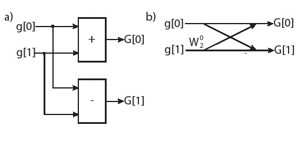

# 规范

## 引用公式
> **[danger] deprecated**
>
> ~~在`http://chart.googleapis.com/chart?cht=tx&chl=\Large%20`后面直接加上latex公式即可生成对应公式的图片。~~
> ~~注意`[]`中写的是公式的编号，请确保下面的链接可以在浏览器中直接访问。~~
> ~~Latex常用公式命令可以参考这里~~
> ~~```x=\frac{-b\pm\sqrt{b^2-4ac}}{2a}```~~

---
> **[success] recommend**
>
>

使用示例:


Inline math: $\int_{-\infty}^\infty g(x) dx$

Block math:

$$
\int_{-\infty}^\infty g(x) dx \quad (4.1)
$$

## 引用代码
只要将代码用```包住，代码块就会被识别为代码

```c
#include "huffman.h"
// Postcondition: out[x].frequency > 0
void filter(
            /* input  */ Symbol in[INPUT_SYMBOL_SIZE],
            /* output */ Symbol out[INPUT_SYMBOL_SIZE],
            /* output */ int *n) {
#pragma HLS INLINE off
    ap_uint<SYMBOL_BITS> j = 0;
    for(int i = 0; i < INPUT_SYMBOL_SIZE; i++) {
#pragma HLS pipeline II=1
        if(in[i].frequency != 0) {
            out[j].frequency = in[i].frequency;
            out[j].value = in[i].value;
            j++;
        }
    }
    *n = j;
}
```

## 引用图片
在行文中使用下述格式引用图片，将图片下方的备注写在`[]`之间
```markdown

```


## 文字加框
### Info styling
> **[info] For info**
>
> Use this for infomation messages.

### Warning styling
> **[warning] For warning**
>
> Use this for warning messages.

### Danger styling
> **[danger] For danger**
>
> Use this for danger messages.

### Success styling
> **[success] For info**
>
> A high-speed computer vision application processes small video frames of 200 * 180 pixels at 10000 frames per second. This application uses a high speed sensor interfaced directly to the FPGA and requires no sync signals. How many samples per clock cycle would you attempt to process? Is this a good FPGA application? Write the nested loop structure to implement this structure using HLS.

## 引用术语
在行文中使用下述格式引用GLOSSARY中的术语即可
```
[bitstream](./GLOSSARY.md#bitstream)
```
[bitstream](./GLOSSARY.md#bitstream)

## 引用参考文献
在行文中使用下述格式引用参考文献即可
```
[[45](./BIBLIOGRAPHY.md#45), [55](./BIBLIOGRAPHY.md#55)]
```
[[45](./BIBLIOGRAPHY.md#45), [55](./BIBLIOGRAPHY.md#55)]
